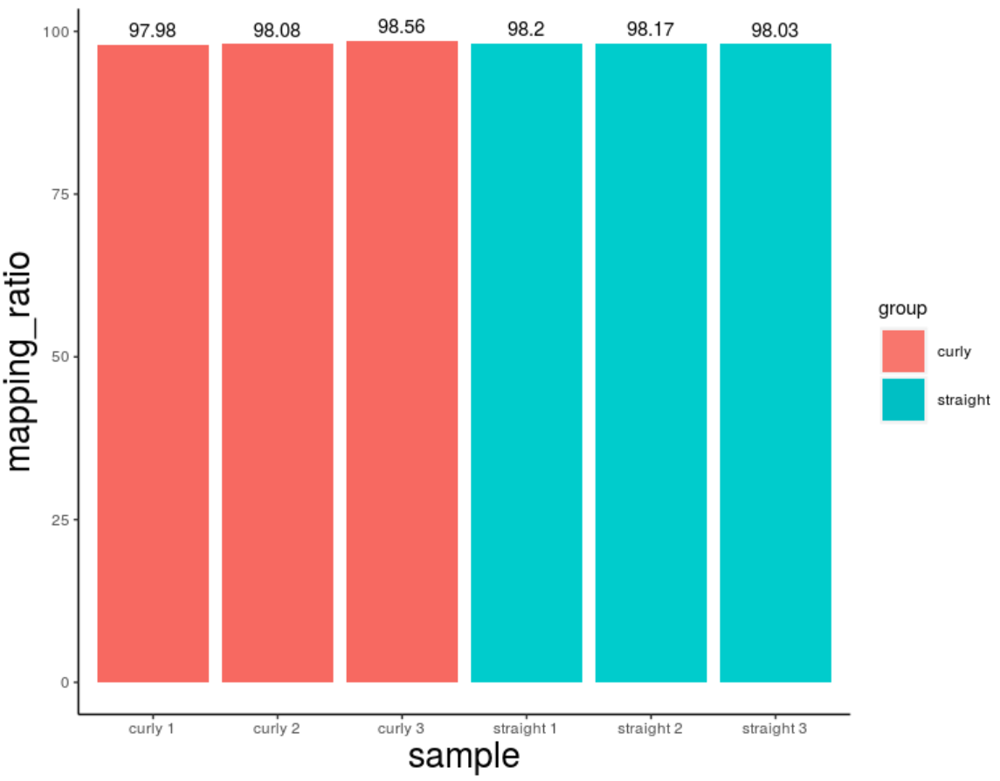
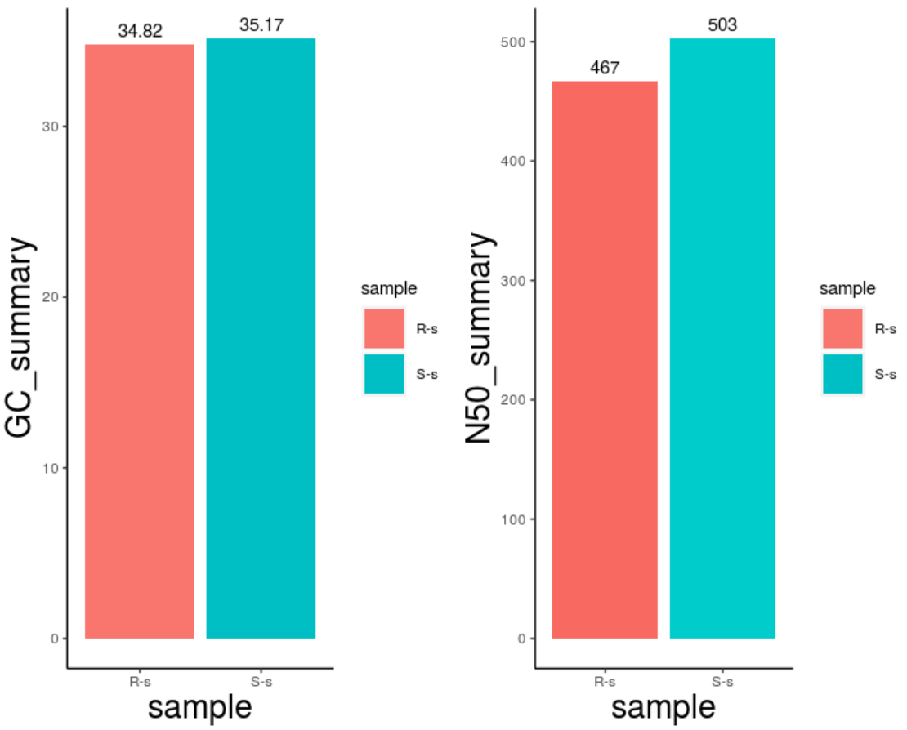
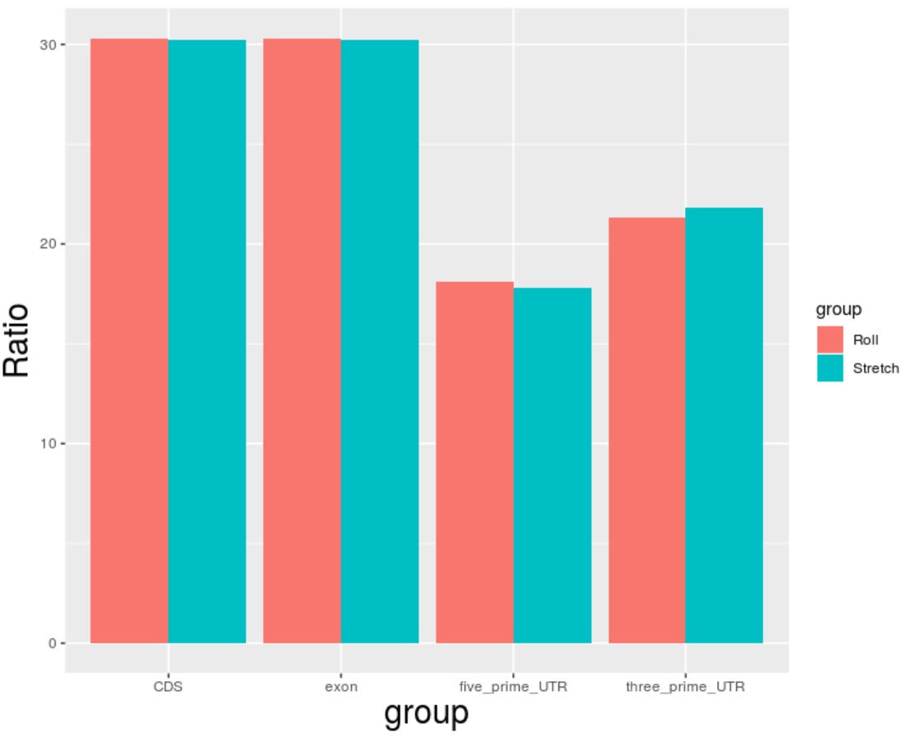
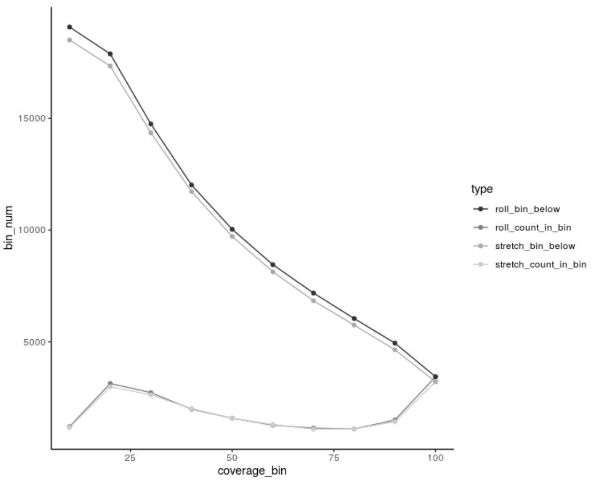

# Figure2 making and Code of analysing

## Qualit control of *de novo* whole transcripts including summarising ratio of re-alignment, GC ratio and N50.

```shell
bowtie2 -p 20 -x /mnt/data/userdata/zhaolei/project/denovo_roly/trinity_strait_all_merge/Trinity_fasta_index \
-1 strait-1_FRAS192303306-1r_1.clean.fq.gz -2 strait-1_FRAS192303306-1r_2.clean.fq.gz | samtools sort -O bam -@ 20 -o - > strait1.bam

98.17% overall alignment rate

bowtie2 -p 20 -x /mnt/data/userdata/zhaolei/project/denovo_roly/trinity_strait_all_merge/Trinity_fasta_index \
-1 strait-2_FRAS192303307-1r_1.clean.fq.gz -2 strait-2_FRAS192303307-1r_2.clean.fq.gz | samtools sort -O bam -@ 20 -o - > strait2.bam

98.20% overall alignment rate

bowtie2 -p 20 -x /mnt/data/userdata/zhaolei/project/denovo_roly/trinity_strait_all_merge/Trinity_fasta_index \
-1 strait-4_FRAS192303308-1r_1.clean.fq.gz -2 strait-4_FRAS192303308-1r_2.clean.fq.gz | samtools sort -O bam -@ 20 -o - > strait4.bam

98.03% overall alignment rate

bowtie2 -p 20 -x /mnt/data/userdata/zhaolei/project/denovo_roly/trinity_curl_all_merge/Trinity_fasta_index \
-1 curl-1_FRAS192303309-1b_1.clean.fq.gz -2 curl-1_FRAS192303309-1b_2.clean.fq.gz | samtools sort -O bam -@ 20 -o - > curl1.bam

97.98% overall alignment rate

bowtie2 -p 20 -x /mnt/data/userdata/zhaolei/project/denovo_roly/trinity_curl_all_merge/Trinity_fasta_index \
-1 curl-3_FRAS192303310-1r_1.clean.fq.gz -2 curl-3_FRAS192303310-1r_2.clean.fq.gz | samtools sort -O bam -@ 20 -o - > curl3.bam

98.08% overall alignment rate

bowtie2 -p 20 -x /mnt/data/userdata/zhaolei/project/denovo_roly/trinity_curl_all_merge/Trinity_fasta_index \
-1 curl-4_FRAS192303311-1r_1.clean.fq.gz -2 curl-4_FRAS192303311-1r_2.clean.fq.gz | samtools sort -O bam -@ 20 -o - > curl4.bam

98.56% overall alignment rate

```

```R
library(ggplot2)

sample <- c("straight 1","straight 2","straight 3","curly 1","curly 2","curly 3")
mapping_ratio <- c(98.20,98.17,98.03,97.98,98.08,98.56)
group <- c("straight","straight","straight","curly","curly","curly")
mydata <- data.frame(sample,mapping_ratio,group)

p0 <- ggplot(mydata,aes(x=sample,y=mapping_ratio,fill=group)) + geom_bar(position="dodge",stat="identity",size = 10)+
geom_bar(stat = "identity", fill = c("#f76961","#f76961","#f76961","#00CCCC","#00CCCC","#00CCCC")) +
geom_text(label=mydata$mapping_ratio ,colour = "black", vjust=-0.5) +
theme(axis.title.x =element_text(size=20), axis.title.y=element_text(size=20)) +
theme(panel.grid.major =element_blank(), panel.grid.minor = element_blank(),panel.background = element_blank(),axis.line = element_line(colour = "black"))
```



```R
/home/zhaolei/miniconda3/envs/trinity/bin/TrinityStats.pl Trinity.fasta > Trinitystats.log

/home/zhaolei/miniconda3/envs/trinity/bin/TrinityStats.pl Trinity.fasta > Trinitystats.log

library(ggplot2)
sample <- c("S-s","R-s")
GC_summary <- c(35.17,34.82)
mydata <- data.frame(sample,GC_summary)

p1 <- ggplot(mydata,aes(x=sample,y=GC_summary,fill=sample)) + geom_bar(position="dodge",stat="identity",size = 10)+
geom_text(label=mydata$GC_summary ,colour = "black", vjust=-0.5) +
theme(axis.title.x =element_text(size=20), axis.title.y=element_text(size=20)) +
theme(panel.grid.major =element_blank(), panel.grid.minor = element_blank(),panel.background = element_blank(),axis.line = element_line(colour = "black"))

sample <- c("S-s","R-s")
N50_summary <- c(503,467)
mydata <- data.frame(sample,N50_summary)

p2 <- ggplot(mydata,aes(x=sample,y=N50_summary,fill=sample)) + geom_bar(position="dodge",stat="identity",size = 10)+
geom_bar(stat = "identity", fill = c("#f76961","#00CCCC")) +
geom_text(label=mydata$N50_summary ,colour = "black", vjust=-0.5) +
theme(axis.title.x =element_text(size=20), axis.title.y=element_text(size=20)) +
theme(panel.grid.major =element_blank(), panel.grid.minor = element_blank(),panel.background = element_blank(),axis.line = element_line(colour = "black"))

multiplot(p1,p2 ,cols=2)
```



```R
/home/zhaolei/miniconda3/envs/transdecoder/bin/TransDecoder.LongOrfs \
-t /mnt/data/userdata/zhaolei/project/denovo_roly/trinity_curl_all_merge/Trinity.fasta \
-O /mnt/data/userdata/zhaolei/project/denovo_roly/go_noref/curl_trans_predict

/home/zhaolei/miniconda3/envs/transdecoder/bin/TransDecoder.LongOrfs \
-t /mnt/data/userdata/zhaolei/project/denovo_roly/trinity_strait_all_merge/Trinity.fasta \
-O /mnt/data/userdata/zhaolei/project/denovo_roly/go_noref/strait_trans_predict

component <- c("CDS","exon","five_prime_UTR","three_prime_UTR")
ratio <- c(30.3,30.3,18.1,21.3)
group <- c("Roll","Roll")
rdata <- data.frame(component,ratio,group)

component <- c("CDS","exon","five_prime_UTR","three_prime_UTR")
ratio <- c(30.2,30.2,17.8,21.8)
group <- c("Stretch","Stretch")
sdata <- data.frame(component,ratio,group)

all_pred <- rbind(rdata,sdata)

p <- ggplot(all_pred,aes(x=component,y=ratio,fill=group))+geom_bar(position="dodge",stat="identity")
p3 <- p+xlab("group") + ylab("Ratio") + labs(fill="group")+
theme(axis.title.x =element_text(size=20), axis.title.y=element_text(size=20))
```



## Homogenous Protein Identified with Swiss-Prot database in all species.

```R
coverage_bin<-c(100,90,80,70,60,50,40,30,20,10)
bin_num<-c(3437,1506,1099,1139,1271,1582,1985,2728,3137,1202,3437,4943,6042,7181,8452,10034,12019,14747,17884,19086,3214,1430,1102,1092,1299,1578,2009,2631,2987,1164,3214,4644,5746,6838,8137,9715,11724,14355,17342,18506)
type<-c("roll_count_in_bin","roll_count_in_bin","roll_count_in_bin","roll_count_in_bin","roll_count_in_bin","roll_count_in_bin","roll_count_in_bin","roll_count_in_bin","roll_count_in_bin","roll_count_in_bin","roll_bin_below","roll_bin_below","roll_bin_below","roll_bin_below","roll_bin_below","roll_bin_below","roll_bin_below","roll_bin_below","roll_bin_below","roll_bin_below","stretch_count_in_bin","stretch_count_in_bin","stretch_count_in_bin","stretch_count_in_bin","stretch_count_in_bin","stretch_count_in_bin","stretch_count_in_bin","stretch_count_in_bin","stretch_count_in_bin","stretch_count_in_bin","stretch_bin_below","stretch_bin_below","stretch_bin_below","stretch_bin_below","stretch_bin_below","stretch_bin_below","stretch_bin_below","stretch_bin_below","stretch_bin_below","stretch_bin_below")
all_pro_cov <- data.frame(coverage_bin,bin_num,type)

p <- ggplot(all_pro_cov, aes(x=coverage_bin, y=bin_num, group=type)) +
     geom_line(aes(color=type))+
     geom_point(aes(color=type))
p + scale_color_grey() + theme_classic()

```

