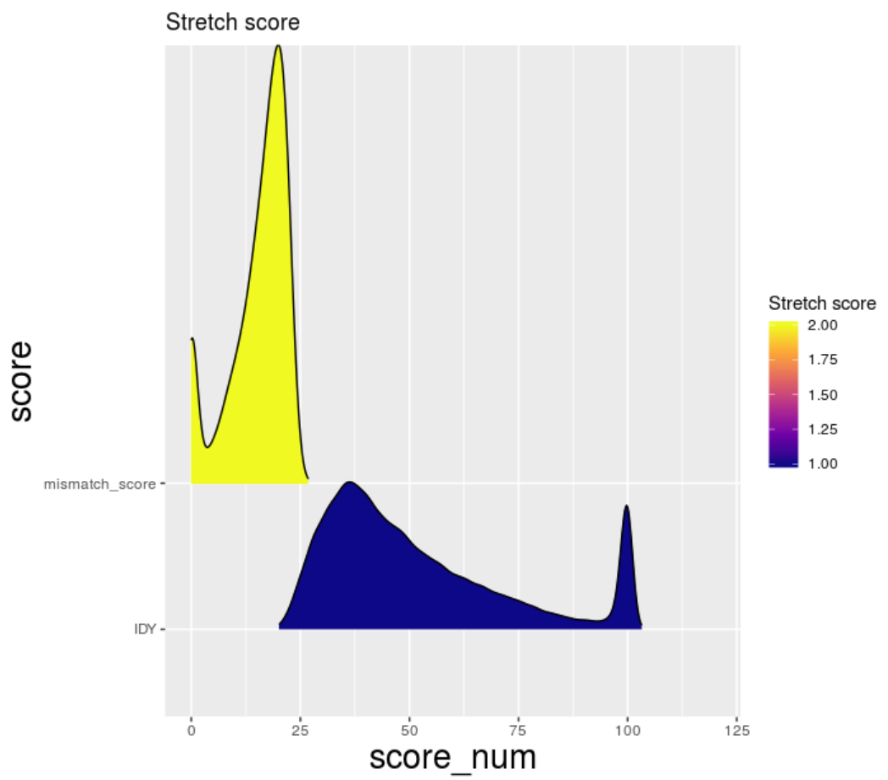

# Figure3 making and Code of analysing

## Summaries of Homogenous Protein score.

```R
Stretch_blastx <- read.csv("Stretch_blastx_v2_outfmt6.csv",row.names = 1)
Roll_blastx <- read.csv("Roll_blastx_v2_outfmt6.csv",row.names = 1)
colnames(Roll_blastx)[3] <- paste("IDY")
colnames(Stretch_blastx)[3] <- paste("IDY")

roll_IDY <- Roll_blastx[,c(3,15)]
roll_mismatch_score <- Roll_blastx[,c(18,15)]
IDY <- c(rep("IDY", 69367))
roll_IDY$score <- IDY
mismatch_score <- c(rep("mismatch_score", 69367))
roll_mismatch_score$score <- mismatch_score
colnames(roll_IDY)[1] <- paste("score_num")
colnames(roll_mismatch_score)[1] <- paste("score_num")
roll_score <- rbind(roll_IDY,roll_mismatch_score)

library(ggplot2)
library(ggridges)
p1 <- ggplot(roll_score, aes(x = score_num, y = score, fill = stat(y))) +
  geom_density_ridges_gradient(scale = 3, rel_min_height = 0.01) +
  scale_fill_viridis_c(name = "roll score", option = "C") +
  xlim(0,120) +
  theme(axis.title.x =element_text(size=20), axis.title.y=element_text(size=20)) +
  labs(title = "roll score")
```


```R
Stretch_IDY <- Stretch_blastx[,c(3,15)]
Stretch_mismatch_score <- Stretch_blastx[,c(18,15)]
IDY <- c(rep("IDY", 65819))
Stretch_IDY$score <- IDY
mismatch_score <- c(rep("mismatch_score", 65819))
Stretch_mismatch_score$score <- mismatch_score
colnames(Stretch_IDY)[1] <- paste("score_num")
colnames(Stretch_mismatch_score)[1] <- paste("score_num")
Stretch_score <- rbind(Stretch_IDY,Stretch_mismatch_score)

p2 <- ggplot(Stretch_score, aes(x = score_num, y = score, fill = stat(y))) +
  geom_density_ridges_gradient(scale = 3, rel_min_height = 0.01) +
  scale_fill_viridis_c(name = "Stretch score", option = "C") +
  xlim(0,120) +
  theme(axis.title.x =element_text(size=20), axis.title.y=element_text(size=20)) +
  labs(title = "Stretch score")
```



## Summaries of Homogenous Protein source.

```R
library(pheatmap)
library(ggplot2)
library(svglite)
library(VennDiagram)

roll_species <- as.data.frame(table(Roll_blastx$ref_species))
roll_species <- roll_species[order(roll_species[,2],decreasing = TRUE),] 
aa <- head(roll_species,9)
sum(aa$Freq)
sum(roll_species$Freq)

species <- c('HUMAN','MOUSE','DROME','RAT','ECOLI','BOVIN','XENLA','CAEEL','DANRE','others(1335 species)')
protein_nums <- c(15607,9820,9080,3402,3237,2050,1887,1734,1615,20935)
Roll_df <- data.frame(species = species, protein_nums = protein_nums)
p3 <- ggplot(data = Roll_df, mapping = aes(x = 'Content', y = protein_nums, fill = species)) + geom_bar(stat = 'identity', position = 'stack')+
     coord_polar(theta = 'y')
```


```R
stretch_species <- as.data.frame(table(Stretch_blastx$ref_species))
stretch_species <- stretch_species[order(stretch_species[,2],decreasing = TRUE),] 
bb <- head(stretch_species,9)
sum(bb$Freq)
sum(stretch_species$Freq)
species <- c('HUMAN','MOUSE','DROME','ECOLI','RAT','BOVIN','XENLA','DANRE','CAEEL','others(1218 species)')
protein_nums <- c(14166,9345,8830,3590,3196,1996,1820,1736,1693,19447)
Stretch_df <- data.frame(species = species, protein_nums = protein_nums)
p4 <- ggplot(data = Stretch_df, mapping = aes(x = 'Content', y = protein_nums, fill = species)) + geom_bar(stat = 'identity', position = 'stack')+
     coord_polar(theta = 'y')

```


