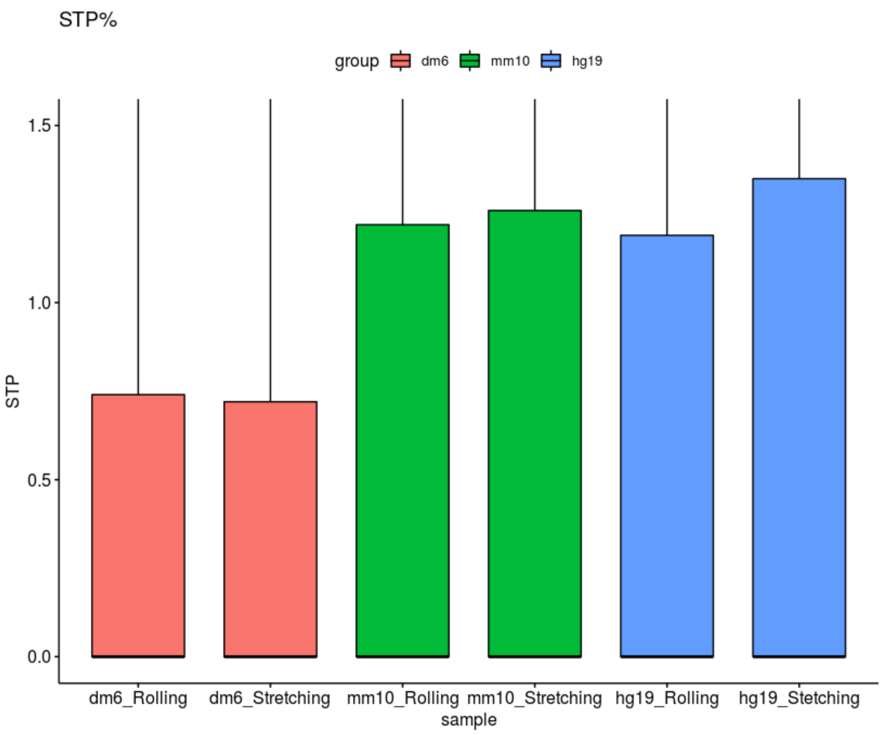

# Figure4 making and Code of analysing

## Alignment with Other species' reference genomic inforamtion

```R
Summary <- read.csv("/mnt/data/user_data/xiangyu/workshop/roly_poly/alignment.csv")
Summary$Map_ratio <- 100*(Summary$Mapped_reads/Summary$Total_reads)
Summary$Forward_strand_ratio <- 100*(Summary$Forward_strand/Summary$Total_reads)
Summary$Both_pairs_mapped_ratio <- 100*(Summary$Both_pairs_mapped/Summary$Total_reads)
Summary$Reverse_strand_ratio <- 100*(Summary$Reverse_strand/Summary$Total_reads)
library(ggpubr)
p1 <- ggbarplot(Summary, x = "data_type", y = "Map_ratio", legend = "none", fill="data_type",
       add = c("mean_se", "jitter"),title="Map_ratio (%)")
p2 <- ggbarplot(Summary, x = "data_type", y = "Forward_strand_ratio", legend = "none", fill="data_type",
       add = c("mean_se", "jitter"),title="Forward_strand_ratio (%)")
p3 <- ggbarplot(Summary, x = "data_type", y = "Reverse_strand_ratio", legend = "none", fill="data_type",
       add = c("mean_se", "jitter"),title="Reverse_strand_ratio (%)")
p4 <- ggbarplot(Summary, x = "data_type", y = "Both_pairs_mapped_ratio", legend = "none", fill="data_type",
       add = c("mean_se", "jitter"),title="Both_pairs_mapped_ratio (%)")
aa <- plot_grid(p1,p2,p3,p4,nrow=1)
ggsave("/mnt/data/user_data/xiangyu/workshop/roly_poly/figure_making/map_ratio_sum.svg", plot=aa,width = 14, height = 5,dpi=1080)
```


## Homology calcualation and quantification based on base sequences and amino acid sequneces by Mummer

```shell
#Drosophila nucmer
nucmer --prefix Drosophila_strait \
/mnt/data/userdata/zhaolei/program/refer/Drosophila/Drosophila_melanogaster/UCSC/dm6/Sequence/WholeGenomeFasta/genome.fa \
/mnt/data/userdata/zhaolei/project/denovo_roly/trinity_strait_all_merge/Trinity.fasta

nucmer --prefix Drosophila_curl \
/mnt/data/userdata/zhaolei/program/refer/Drosophila/Drosophila_melanogaster/UCSC/dm6/Sequence/WholeGenomeFasta/genome.fa \
/mnt/data/userdata/zhaolei/project/denovo_roly/trinity_curl_all_merge/Trinity.fasta

dnadiff -d Drosophila_curl.delta

delta-filter -i 70 -l 50 -1 IRGSP1_DHX2.delta > IRGSP1_DHX2_i89_l1000_1.delta.filter

show-coords -r Drosophila_strait.delta > Drosophila_strait_anno.coord

#intersect
bedtools intersect -a dm6_strait_all_anno.bed -b dm6.gene_only.bed -wa -wb > roly_strait_anno_dm6_position.bed
bedtools intersect -a dm6_curl_all_anno.bed -b dm6.gene_only.bed -wa -wb > roly_curl_anno_dm6_position.bed


#mouse nucmer
nucmer --prefix mouse_mm10_strait \
/mnt/data/public_data/reference/Mus_musculus_UCSC/UCSC/mm10/Sequence/WholeGenomeFasta/genome.fa \
/mnt/data/userdata/zhaolei/project/denovo_roly/trinity_strait_all_merge/Trinity.fasta

nucmer --prefix mouse_mm10_curl \
/mnt/data/public_data/reference/Mus_musculus_UCSC/UCSC/mm10/Sequence/WholeGenomeFasta/genome.fa \
/mnt/data/userdata/zhaolei/project/denovo_roly/trinity_curl_all_merge/Trinity.fasta

dnadiff -d mouse_mm10_strait.delta
dnadiff -d mouse_mm10_curl.delta

show-coords -r mouse_mm10_strait.delta > mouse_mm10_strait_anno.coord
show-coords -r mouse_mm10_curl.delta > mouse_mm10_curl_anno.coord

#intersect
bedtools intersect -a mouse_mm10_strait_all_anno.bed -b /mnt/data/userdata/zhaolei/project/bulk_RNA_seq/sclc_kmt2c_muta/dnmt3a_data/mm10.position.txt -wa -wb > roly_strait_anno_mm10_position.bed
bedtools intersect -a mouse_mm10_curl_all_anno.bed -b /mnt/data/userdata/zhaolei/project/bulk_RNA_seq/sclc_kmt2c_muta/dnmt3a_data/mm10.position.txt -wa -wb > roly_curl_anno_mm10_position.bed


#human nucmer
nucmer --prefix human_hg19_strait \
/mnt/data/sequencedata/hg19/Homo_sapiens/UCSC/hg19/Sequence/WholeGenomeFasta/genome.fa \
/mnt/data/userdata/zhaolei/project/denovo_roly/trinity_strait_all_merge/Trinity.fasta

nucmer --prefix human_hg19_curl \
/mnt/data/sequencedata/hg19/Homo_sapiens/UCSC/hg19/Sequence/WholeGenomeFasta/genome.fa \
/mnt/data/userdata/zhaolei/project/denovo_roly/trinity_curl_all_merge/Trinity.fasta

dnadiff -d human_hg19_strait.delta
dnadiff -d human_hg19_curl.delta

show-coords -r human_hg19_strait.delta > human_hg19_strait_anno.coord
show-coords -r human_hg19_curl.delta > human_hg19_curl_anno.coord

#intersect
bedtools intersect -a human_hg19_strait_all_anno.bed -b /mnt/data/userdata/zhaolei/project/bulk_RNA_seq/sclc_kmt2c_muta/dnmt3a_data/hg19.position.txt -wa -wb > roly_strait_anno_hg19_position.bed
bedtools intersect -a human_hg19_curl_all_anno.bed -b /mnt/data/userdata/zhaolei/project/bulk_RNA_seq/sclc_kmt2c_muta/dnmt3a_data/hg19.position.txt -wa -wb > roly_curl_anno_hg19_position.bed
```

```R
mouse_mm10_strait <- read.table("/mnt/data/userdata/zhaolei/project/denovo_roly/mm10_align/roly_strait_anno_mm10_position.txt")
mouse_mm10_curl <- read.table("/mnt/data/userdata/zhaolei/project/denovo_roly/mm10_align/roly_curl_anno_mm10_position.txt")
mouse_mm10_strait_IDY <- mouse_mm10_strait[,c(5,10,11)]
mouse_mm10_curl_IDY <- mouse_mm10_curl[,c(5,10,11)]

human_hg19_strait <- read.table("/mnt/data/userdata/zhaolei/project/denovo_roly/hg19_align/roly_strait_anno_hg19_position.txt")
human_hg19_curl <- read.table("/mnt/data/userdata/zhaolei/project/denovo_roly/hg19_align/roly_curl_anno_hg19_position.txt")
human_hg19_strait_IDY <- human_hg19_strait[,c(5,10,11)]
human_hg19_curl_IDY <- human_hg19_curl[,c(5,10,11)]

dm6_strait <- read.table("/mnt/data/userdata/zhaolei/project/denovo_roly/Drosophila_align/roly_strait_anno_dm6_position.txt")
dm6_curl <- read.table("/mnt/data/userdata/zhaolei/project/denovo_roly/Drosophila_align/roly_curl_anno_dm6_position.txt")
dm6_strait_IDY <- dm6_strait[,c(5,10,11)]
dm6_curl_IDY <- dm6_curl[,c(5,10,11)]

all_IDY <- rbind(mouse_mm10_curl_IDY,mouse_mm10_strait_IDY,human_hg19_curl_IDY,human_hg19_strait_IDY,dm6_curl_IDY,dm6_strait_IDY)
colnames(all_IDY)[1] <- paste("IDY")
colnames(all_IDY)[2] <- paste("sample")
colnames(all_IDY)[3] <- paste("group")

library(ggpubr)
p1 = ggboxplot(all_IDY, x = "sample", y = "IDY", fill="group",
  title="IDY%", outlier.shape = NA,ylim=c(97,100))
```


```R
sample <- c("straight","curly")
align_gene_number <- c(59,65)
group <- c("Drosophlia","Drosophlia")
dmdata <- data.frame(sample,align_gene_number,group)

sample <- c("straight","curly")
align_gene_number <- c(466,1021)
group <- c("mouse","mouse")
micedata <- data.frame(sample,align_gene_number,group)

sample <- c("straight","curly")
align_gene_number <- c(523,779)
group <- c("human","human")
hgdata <- data.frame(sample,align_gene_number,group)

all_align <- rbind(dmdata,micedata,hgdata)
p <- ggplot(all_align,aes(x=group,y=align_gene_number,fill=sample))+geom_bar(position="dodge",stat="identity")
p2 <- p+xlab("group") + ylab("contigs number") + labs(fill="sample")+
theme(axis.title.x =element_text(size=20), axis.title.y=element_text(size=20))

```


```shell
#Drosophila nucmer
promer --prefix /mnt/data/userdata/zhaolei/project/denovo_roly/Drosophila_align/promer_ref/promer_dm6_strait \
/mnt/data/userdata/zhaolei/program/refer/Drosophila/Drosophila_melanogaster/UCSC/dm6/Sequence/WholeGenomeFasta/genome.fa \
/mnt/data/userdata/zhaolei/project/denovo_roly/trinity_strait_all_merge/Trinity.fasta

promer --prefix /mnt/data/userdata/zhaolei/project/denovo_roly/Drosophila_align/promer_ref/promer_dm6_curl \
/mnt/data/userdata/zhaolei/program/refer/Drosophila/Drosophila_melanogaster/UCSC/dm6/Sequence/WholeGenomeFasta/genome.fa \
/mnt/data/userdata/zhaolei/project/denovo_roly/trinity_curl_all_merge/Trinity.fasta

dnadiff -p promer_dm6_curl -d promer_dm6_curl.delta
show-coords -r -l promer_dm6_curl.delta > promer_dm6_curl_anno.coord

dnadiff -p promer_dm6_strait -d promer_dm6_strait.delta
show-coords -r -l promer_dm6_strait.delta > promer_dm6_strait_anno.coord

bedtools intersect -a promer_drosophila_strait_use_intersect.bed -b dm6.gene_only.bed -wa -wb > roly_strait_anno_dm6_AA_position.bed
bedtools intersect -a promer_drosophila_curl_use_intersect.bed -b dm6.gene_only.bed -wa -wb > roly_curl_anno_dm6_AA_position.bed

#mouse nucmer
promer --prefix /mnt/data/userdata/zhaolei/project/denovo_roly/mm10_align/promer_ref/promer_mouse_mm10_strait \
/mnt/data/public_data/reference/Mus_musculus_UCSC/UCSC/mm10/Sequence/WholeGenomeFasta/genome.fa \
/mnt/data/userdata/zhaolei/project/denovo_roly/trinity_strait_all_merge/Trinity.fasta

promer --prefix /mnt/data/userdata/zhaolei/project/denovo_roly/mm10_align/promer_ref/promer_mouse_mm10_curl \
/mnt/data/public_data/reference/Mus_musculus_UCSC/UCSC/mm10/Sequence/WholeGenomeFasta/genome.fa \
/mnt/data/userdata/zhaolei/project/denovo_roly/trinity_curl_all_merge/Trinity.fasta

dnadiff -p promer_mm10_curl -d promer_mouse_mm10_curl.delta
show-coords -r promer_mouse_mm10_strait.delta > promer_mouse_mm10_strait_anno.coord
dnadiff -p promer_mm10_strait -d promer_mouse_mm10_strait.delta
show-coords -r promer_mouse_mm10_curl.delta > promer_mouse_mm10_curl_anno.coord

bedtools intersect -a promer_mm10_strait_use_intersect.bed -b /mnt/data/userdata/zhaolei/project/bulk_RNA_seq/sclc_kmt2c_muta/dnmt3a_data/mm10.position.txt -wa -wb > roly_strait_anno_mm10_AA_position.bed
bedtools intersect -a promer_mm10_curl_use_intersect.bed -b /mnt/data/userdata/zhaolei/project/bulk_RNA_seq/sclc_kmt2c_muta/dnmt3a_data/mm10.position.txt -wa -wb > roly_curl_anno_mm10_AA_position.bed

#human nucmer
promer --prefix /mnt/data/userdata/zhaolei/project/denovo_roly/hg19_align/promer_ref/promer_human_hg19_strait \
/mnt/data/sequencedata/hg19/Homo_sapiens/UCSC/hg19/Sequence/WholeGenomeFasta/genome.fa \
/mnt/data/userdata/zhaolei/project/denovo_roly/trinity_strait_all_merge/Trinity.fasta

promer --prefix /mnt/data/userdata/zhaolei/project/denovo_roly/hg19_align/promer_ref/promer_human_hg19_curl \
/mnt/data/sequencedata/hg19/Homo_sapiens/UCSC/hg19/Sequence/WholeGenomeFasta/genome.fa \
/mnt/data/userdata/zhaolei/project/denovo_roly/trinity_curl_all_merge/Trinity.fasta

show-coords -r promer_human_hg19_strait.delta > promer_human_hg19_strait_anno.coord
show-coords -r promer_human_hg19_curl.delta > promer_human_hg19_curl_anno.coord

dnadiff -p promer_hg19_curl -d promer_human_hg19_curl.delta

dnadiff -p promer_hg19_strait -d promer_human_hg19_strait.delta

bedtools intersect -a promer_hg19_strait_use_intersect.bed -b /mnt/data/userdata/zhaolei/project/bulk_RNA_seq/sclc_kmt2c_muta/dnmt3a_data/hg19.position.txt -wa -wb > roly_strait_anno_hg19_AA_position.bed
bedtools intersect -a promer_hg19_curl_use_intersect.bed -b /mnt/data/userdata/zhaolei/project/bulk_RNA_seq/sclc_kmt2c_muta/dnmt3a_data/hg19.position.txt -wa -wb > roly_curl_anno_hg19_AA_position.bed
```

```R
dm6_curl_AA <- read.table("/mnt/data/userdata/zhaolei/project/denovo_roly/Drosophila_align/AA_promer/roly_curl_anno_dm6_AA_position.bed")
dm6_strait_AA <- read.table("/mnt/data/userdata/zhaolei/project/denovo_roly/Drosophila_align/AA_promer/roly_strait_anno_dm6_AA_position.bed")
AA_dm6_curl_IDY <- dm6_curl_AA[,c(8,16,17)]
AA_dm6_strait_IDY <- dm6_strait_AA[,c(8,16,17)]
AA_dm6_curl_SIM <- dm6_curl_AA[,c(9,16,17)]
AA_dm6_strait_SIM <- dm6_strait_AA[,c(9,16,17)]
AA_dm6_curl_STP <- dm6_curl_AA[,c(10,16,17)]
AA_dm6_strait_STP <- dm6_strait_AA[,c(10,16,17)]

mm10_curl_AA <- read.table("/mnt/data/userdata/zhaolei/project/denovo_roly/mm10_align/AA_promer/roly_curl_anno_mm10_AA_position.bed")
mm10_strait_AA <- read.table("/mnt/data/userdata/zhaolei/project/denovo_roly/mm10_align/AA_promer/roly_strait_anno_mm10_AA_position.bed")
AA_mm10_curl_IDY <- mm10_curl_AA[,c(8,16,17)]
AA_mm10_strait_IDY <- mm10_strait_AA[,c(8,16,17)]
AA_mm10_curl_SIM <- mm10_curl_AA[,c(9,16,17)]
AA_mm10_strait_SIM <- mm10_strait_AA[,c(9,16,17)]
AA_mm10_curl_STP <- mm10_curl_AA[,c(10,16,17)]
AA_mm10_strait_STP <- mm10_strait_AA[,c(10,16,17)]

hg19_curl_AA <- read.table("/mnt/data/userdata/zhaolei/project/denovo_roly/hg19_align/AA_promer/roly_curl_anno_hg19_AA_position.bed")
hg19_strait_AA <- read.table("/mnt/data/userdata/zhaolei/project/denovo_roly/hg19_align/AA_promer/roly_strait_anno_hg19_AA_position.bed")
AA_hg19_curl_IDY <- hg19_curl_AA[,c(8,16,17)]
AA_hg19_strait_IDY <- hg19_strait_AA[,c(8,16,17)]
AA_hg19_curl_SIM <- hg19_curl_AA[,c(9,16,17)]
AA_hg19_strait_SIM <- hg19_strait_AA[,c(9,16,17)]
AA_hg19_curl_STP <- hg19_curl_AA[,c(10,16,17)]
AA_hg19_strait_STP <- hg19_strait_AA[,c(10,16,17)]

library(ggpubr)
AA_all_IDY <- rbind(AA_dm6_curl_IDY,AA_dm6_strait_IDY,AA_mm10_curl_IDY,AA_mm10_strait_IDY,AA_hg19_curl_IDY,AA_hg19_strait_IDY)
colnames(AA_all_IDY)[1] <- paste("IDY")
colnames(AA_all_IDY)[2] <- paste("sample")
colnames(AA_all_IDY)[3] <- paste("group")

p1 = ggboxplot(AA_all_IDY, x = "sample", y = "IDY", fill="group",
  title="IDY%", outlier.shape = NA, ylim = c(40,100))
pdf("mummer_AA_align_IDY_dif_species.pdf",width = 10,height = 7)
p1
dev.off()
```


```R
AA_all_SIM <- rbind(AA_dm6_curl_SIM,AA_dm6_strait_SIM,AA_mm10_curl_SIM,AA_mm10_strait_SIM,AA_hg19_curl_SIM,AA_hg19_strait_SIM)
colnames(AA_all_SIM)[1] <- paste("SIM")
colnames(AA_all_SIM)[2] <- paste("sample")
colnames(AA_all_SIM)[3] <- paste("group")

p2 = ggboxplot(AA_all_SIM, x = "sample", y = "SIM", fill="group",
  title="SIM%", outlier.shape = NA, ylim = c(60,100))
pdf("mummer_AA_align_SIM_dif_species.pdf",width = 10,height = 7)
p2
dev.off()
```


```R
AA_all_STP <- rbind(AA_dm6_curl_STP,AA_dm6_strait_STP,AA_mm10_curl_STP,AA_mm10_strait_STP,AA_hg19_curl_STP,AA_hg19_strait_STP)
colnames(AA_all_STP)[1] <- paste("STP")
colnames(AA_all_STP)[2] <- paste("sample")
colnames(AA_all_STP)[3] <- paste("group")

p3 = ggboxplot(AA_all_STP, x = "sample", y = "STP", fill="group",
  title="STP%", outlier.shape = NA, ylim = c(0,1.5))
pdf("mummer_AA_align_STP_dif_species.pdf",width = 10,height = 7)
p3
dev.off()
```



```R
library(tidyverse)
dm6_curl_AA <- read.table("/mnt/data/userdata/zhaolei/project/denovo_roly/Drosophila_align/AA_promer/roly_curl_anno_dm6_AA_position.bed")
dm6_strait_AA <- read.table("/mnt/data/userdata/zhaolei/project/denovo_roly/Drosophila_align/AA_promer/roly_strait_anno_dm6_AA_position.bed")
dm6_curl_gene <- dm6_curl_AA[!duplicated(dm6_curl_AA$V15),]
dm6_strait_gene <- dm6_strait_AA[!duplicated(dm6_strait_AA$V15),]
dim(dm6_curl_gene) 3425   16
dim(dm6_strait_gene) 3505   15
dm6_curl_AA_sim <- dm6_curl_AA %>% filter(V9>80)
dm6_strait_AA_sim <- dm6_strait_AA %>% filter(V9>80)
dm6_curl_gene_sim <- dm6_curl_AA_sim[!duplicated(dm6_curl_AA_sim$V15),]
dm6_strait_gene_sim <- dm6_strait_AA_sim[!duplicated(dm6_strait_AA_sim$V15),]
dim(dm6_curl_gene_sim) 1822   16
dim(dm6_strait_gene_sim) 1923   15

mm10_curl_AA <- read.table("/mnt/data/userdata/zhaolei/project/denovo_roly/mm10_align/AA_promer/roly_curl_anno_mm10_AA_position.bed")
mm10_strait_AA <- read.table("/mnt/data/userdata/zhaolei/project/denovo_roly/mm10_align/AA_promer/roly_strait_anno_mm10_AA_position.bed")
mm10_curl_gene <- mm10_curl_AA[!duplicated(mm10_curl_AA$V15),]
mm10_strait_gene <- mm10_strait_AA[!duplicated(mm10_strait_AA$V15),]
dim(mm10_curl_gene) 6302   15
dim(mm10_strait_gene) 5867   16
mm10_curl_AA_sim <- mm10_curl_AA %>% filter(V9>80)
mm10_strait_AA_sim <- mm10_strait_AA %>% filter(V9>80)
mm10_curl_gene_sim <- mm10_curl_AA_sim[!duplicated(mm10_curl_AA_sim$V15),]
mm10_strait_gene_sim <- mm10_strait_AA_sim[!duplicated(mm10_strait_AA_sim$V15),]
dim(mm10_curl_gene_sim) 5208   15
dim(mm10_strait_gene_sim) 4826   16

hg19_curl_AA <- read.table("/mnt/data/userdata/zhaolei/project/denovo_roly/hg19_align/AA_promer/roly_curl_anno_hg19_AA_position.bed")
hg19_strait_AA <- read.table("/mnt/data/userdata/zhaolei/project/denovo_roly/hg19_align/AA_promer/roly_strait_anno_hg19_AA_position.bed")
hg19_curl_gene <- hg19_curl_AA[!duplicated(hg19_curl_AA$V15),]
hg19_strait_gene <- hg19_strait_AA[!duplicated(hg19_strait_AA$V15),]
dim(hg19_curl_gene) 5249   15
dim(hg19_strait_gene) 4805   15
hg19_curl_AA_sim <- hg19_curl_AA %>% filter(V9>80)
hg19_strait_AA_sim <- hg19_strait_AA %>% filter(V9>80)
hg19_curl_gene_sim <- hg19_curl_AA_sim[!duplicated(hg19_curl_AA_sim$V15),]
hg19_strait_gene_sim <- hg19_strait_AA_sim[!duplicated(hg19_strait_AA_sim$V15),]
dim(hg19_curl_gene_sim) 4389
dim(hg19_strait_gene_sim) 3982

sample <- c("Stretching","Rolling")
align_gene_number <- c(1923,1822)
group <- c("Drosophlia","Drosophlia")
dmdata <- data.frame(sample,align_gene_number,group)

sample <- c("Stretching","Rolling")
align_gene_number <- c(4826,5208)
group <- c("mouse","mouse")
micedata <- data.frame(sample,align_gene_number,group)

sample <- c("Stretching","Rolling")
align_gene_number <- c(3982,4389)
group <- c("human","human")
hgdata <- data.frame(sample,align_gene_number,group)

all_align <- rbind(dmdata,micedata,hgdata)

p <- ggplot(all_align,aes(x=group,y=align_gene_number,fill=sample))+geom_bar(position="dodge",stat="identity")
p <- p+xlab("group") + ylab("Align gene number") + labs(fill="sample")+
theme(axis.title.x =element_text(size=20), axis.title.y=element_text(size=20))
```

