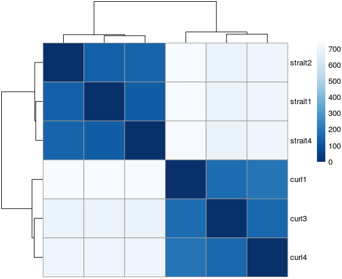
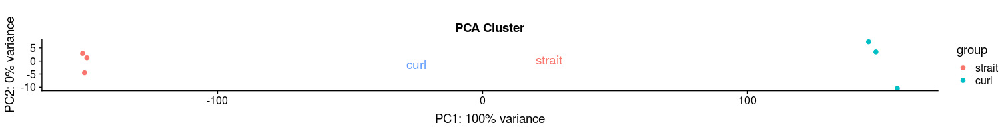
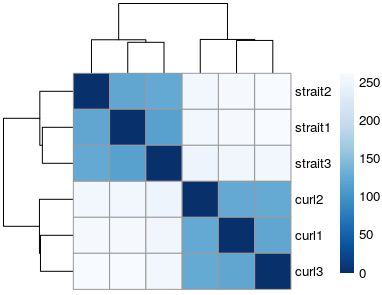
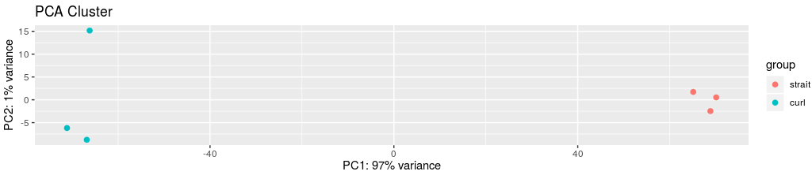
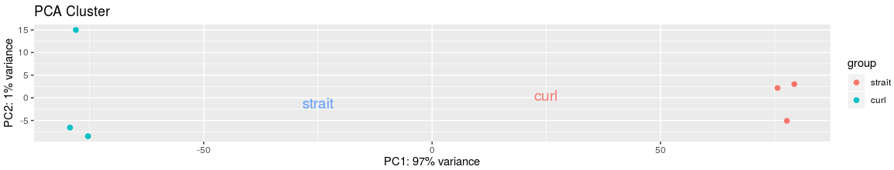
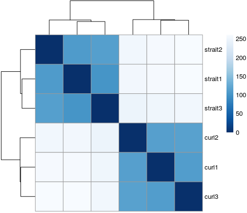
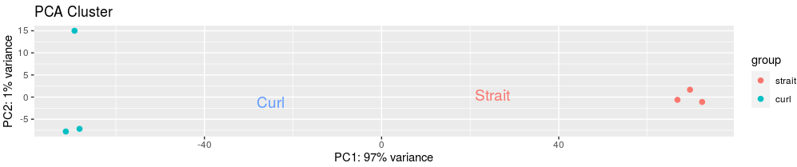
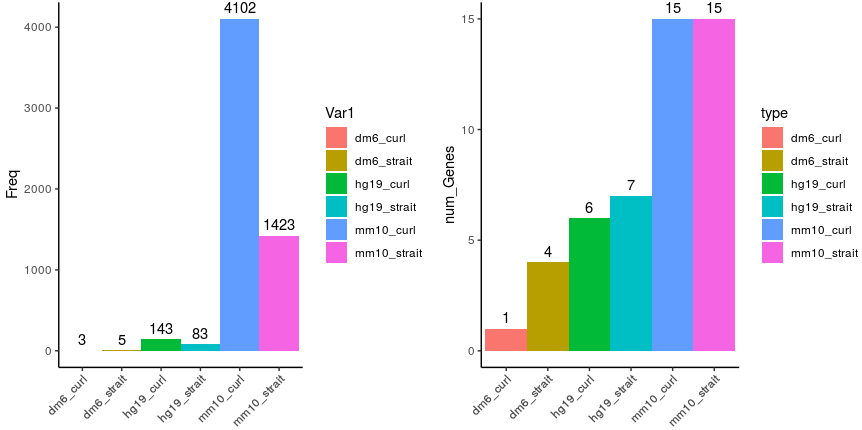
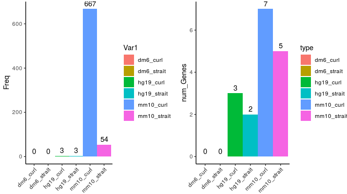
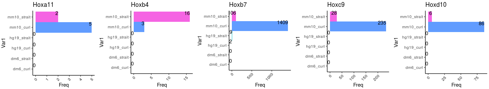

# Figure5 making and Code of analysing

## Firstly, we need to convert the Swiss ID to GO ID in each sample with annotated Trnity results.

### Loading required packages

```R
suppressPackageStartupMessages({
  library(dplyr)
  library(Seurat)
  library(Matrix)
  library(proxy)
  library(gplots)
  library(Rtsne)
  library(densityClust)
  library(irlba)
  library(monocle)
  library(plyr)
  library(DOSE)
  library(clusterProfiler)
  library(topGO)
  library(pathview)
  library(AnnotationDbi)
  library(cowplot)
  library(ggplot2)
  library(velocyto.R)
  library(trqwe)
  library(Rsamtools)
  library(GenomicFeatures)
  library(GenomicAlignments)
  library(BiocParallel)
  library(pheatmap)
  library(RColorBrewer)
  library(PoiClaClu)
  library(org.Mm.eg.db)
  library(org.Hs.eg.db)
  library(DESeq2)
  library(data.table)
  library(stringr)
  library(iTALK)
  library(nichenetr)
  library(tidyr)
})
source("/mnt/data/user_data/xiangyu/programme/R_PACKAGES/my_code/MyBestFunction_scRNA.R")
source("/mnt/data/user_data/xiangyu/programme/R_PACKAGES/my_code/Pseudo_CNV_series.R")
library(future)
library(future.apply)
options(future.globals.maxSize = 300 * 1024^3)
plan("multiprocess", workers = 15)
plan()

swiss_go.list <- fread("/mnt/data/user_data/xiangyu/workshop/roly_poly/GO_ID_SWISS/swiss_go.list")
swiss_go.list <- fread("/mnt/data/userdata/zhaolei/project/denovo_roly/go_noref/swiss_go.list")
colnames(swiss_go.list)[2] <- "GO_0046782"
swiss_go.list_f <- subset(swiss_go.list,GO_0046782 !="")
swiss_go.list_f1 <- rbind(data.frame(Q6GZX4="Q6GZX4",GO_0046782="GO:0046782"),swiss_go.list_f)
library(trqwe)
mcsaveRDS(swiss_go.list_f1,"/mnt/data/userdata/zhaolei/project/denovo_roly/go_noref/swiss_go.list_filter.rds",mc.cores=30)
mcsaveRDS(swiss_go.list_f1,"/mnt/data/user_data/xiangyu/workshop/roly_poly/GO_ID_SWISS/swiss_go.list_filter.rds",mc.cores=30)

swiss_go.list_f1 <- mcreadRDS("/mnt/data/user_data/xiangyu/workshop/roly_poly/GO_ID_SWISS/swiss_go.list_filter.rds",mc.cores=30)
curl_swiss <- fread("/mnt/data/user_data/xiangyu/workshop/roly_poly/GO_ID_SWISS/curl.swiss_dia_matches.m8")
curl_swiss <- as.data.frame(curl_swiss)
curl_swiss$swiss_ID <- unlist(future_lapply(strsplit(curl_swiss$V2,"[.]"),function(x){
  return(x[1])
}))
both_id <- intersect(curl_swiss$swiss_ID,swiss_go.list_f1$Q6GZX4)
curl_swiss_both <- XY_subset(curl_swiss,"swiss_ID",both_id)
swiss_go.list_f1 <- as.data.frame(swiss_go.list_f1)
rownames(swiss_go.list_f1) <- swiss_go.list_f1$Q6GZX4
swiss_go.list_f1$Q6GZX4 <- as.character(swiss_go.list_f1$Q6GZX4)
swiss_go.list_f1$GO_0046782 <- as.character(swiss_go.list_f1$GO_0046782)
curl_swiss_both$GO_Id <- swiss_go.list_f1[curl_swiss_both$swiss_ID,]$GO_0046782
curl_swiss_indiv <- XY_subset(curl_swiss,"swiss_ID",setdiff(curl_swiss$swiss_ID,both_id))
curl_swiss_indiv$GO_Id <- "NoAnno"
curl_swiss_all <- rbind(curl_swiss_indiv,curl_swiss_both)
fwrite(x = curl_swiss_all, file = "/mnt/data/user_data/xiangyu/workshop/roly_poly/GO_ID_SWISS/curl.swiss_dia_matches.m8_anno_go", row.names = FALSE,quote = FALSE, col.names = FALSE, sep = "\t")

swiss_go.list_f1 <- mcreadRDS("/mnt/data/user_data/xiangyu/workshop/roly_poly/GO_ID_SWISS/swiss_go.list_filter.rds",mc.cores=30)
strait_swiss <- fread("/mnt/data/user_data/xiangyu/workshop/roly_poly/GO_ID_SWISS/strait.swiss_dia_matches.m8")
strait_swiss <- as.data.frame(strait_swiss)
strait_swiss$swiss_ID <- unlist(future_lapply(strsplit(strait_swiss$V2,"[.]"),function(x){
  return(x[1])
}))
both_id <- intersect(strait_swiss$swiss_ID,swiss_go.list_f1$Q6GZX4)
strait_swiss_both <- XY_subset(strait_swiss,"swiss_ID",both_id)
swiss_go.list_f1 <- as.data.frame(swiss_go.list_f1)
rownames(swiss_go.list_f1) <- swiss_go.list_f1$Q6GZX4
swiss_go.list_f1$Q6GZX4 <- as.character(swiss_go.list_f1$Q6GZX4)
swiss_go.list_f1$GO_0046782 <- as.character(swiss_go.list_f1$GO_0046782)
strait_swiss_both$GO_Id <- swiss_go.list_f1[strait_swiss_both$swiss_ID,]$GO_0046782
strait_swiss_indiv <- XY_subset(strait_swiss,"swiss_ID",setdiff(strait_swiss$swiss_ID,both_id))
strait_swiss_indiv$GO_Id <- "NoAnno"
strait_swiss_all <- rbind(strait_swiss_indiv,strait_swiss_both)
fwrite(x = strait_swiss_all, file = "/mnt/data/user_data/xiangyu/workshop/roly_poly/GO_ID_SWISS/strait.swiss_dia_matches.m8_anno_go", row.names = FALSE,quote = FALSE, col.names = FALSE, sep = "\t")
```

## Then, we need to merge All samples Swiss ID.

```R
roll_count <- read.csv("/mnt/data/userdata/zhaolei/project/denovo_roly/abundance_quantify/gtf_files/culr_sample/transcript_count_matrix.csv",row.names = 1)
roll_swiss_go <- read.csv("/mnt/data/userdata/zhaolei/project/denovo_roly/go_noref/curl_swiss_go_match.csv",row.names = 1)
roll_count$trans_id_1 <- rownames(roll_count)
roll_swiss_go <- subset(roll_swiss_go,GO_id!="NoAnno")
roll_swiss_go$new_id <- paste(roll_swiss_go$trans_id_1,roll_swiss_go$trans_id,roll_swiss_go$swiss_id_1,roll_swiss_go$GO_id,sep="_")
roll_swiss_go <- roll_swiss_go[!duplicated(roll_swiss_go$new_id),]
roll_swiss_go$trans_id_1 <- as.character(roll_swiss_go$trans_id_1)
roll_swiss_go$trans_id_1[table(roll_swiss_go$trans_id_1)>1]
roll_swiss_go$trans_id <- as.character(roll_swiss_go$trans_id)
roll_swiss_go$trans_id[table(roll_swiss_go$trans_id)>1]
roll_swiss_go$GO_id <- as.character(roll_swiss_go$GO_id)
library(stringr)
library(data.table)
roll_swiss_go_uni_T <- future_lapply(1:length(unique(roll_swiss_go$trans_id)),function(x) {
    sel_g <- subset(roll_swiss_go,trans_id==unique(roll_swiss_go$trans_id)[x])
  if (nrow(sel_g)>1) {
    sel_g$swiss_id <- str_c(unique(sel_g$swiss_id),collapse="|")
    new_data <- sel_g[1,]
    } else {
      new_data <- sel_g
    }
    return(new_data)
  })
roll_swiss_go_uni_T <- as.data.frame(rbindlist(roll_swiss_go_uni_T))
library(trqwe)
mcsaveRDS(roll_swiss_go_uni_T,"/mnt/data/userdata/zhaolei/project/denovo_roly/go_noref/roll_swiss_go_uni_T.rds",mc.cores=20)

stretch_count <- read.csv("/mnt/data/userdata/zhaolei/project/denovo_roly/abundance_quantify/gtf_files/strait_sample/transcript_count_matrix.csv",row.names = 1)
stretch_swiss_go <- read.csv("/mnt/data/userdata/zhaolei/project/denovo_roly/go_noref/stretch_swiss_go_match.csv",row.names = 1)
stretch_count$trans_id_1 <- rownames(stretch_count)
stretch_swiss_go <- subset(stretch_swiss_go,GO_id!="NoAnno")
stretch_swiss_go$new_id <- paste(stretch_swiss_go$trans_id_1,stretch_swiss_go$trans_id,stretch_swiss_go$swiss_id_1,stretch_swiss_go$GO_id,sep="_")
stretch_swiss_go <- stretch_swiss_go[!duplicated(stretch_swiss_go$new_id),]
stretch_swiss_go$trans_id_1 <- as.character(stretch_swiss_go$trans_id_1)
stretch_swiss_go$trans_id_1[table(stretch_swiss_go$trans_id_1)>1]
stretch_swiss_go$trans_id <- as.character(stretch_swiss_go$trans_id)
stretch_swiss_go$trans_id[table(stretch_swiss_go$trans_id)>1]
stretch_swiss_go$GO_id <- as.character(stretch_swiss_go$GO_id)
library(stringr)
library(data.table)
stretch_swiss_go_uni_T <- future_lapply(1:length(unique(stretch_swiss_go$trans_id)),function(x) {
    sel_g <- subset(stretch_swiss_go,trans_id==unique(stretch_swiss_go$trans_id)[x])
  if (nrow(sel_g)>1) {
    sel_g$swiss_id <- str_c(unique(sel_g$swiss_id),collapse="|")
    new_data <- sel_g[1,]
    } else {
      new_data <- sel_g
    }
    return(new_data)
  })
stretch_swiss_go_uni_T <- as.data.frame(rbindlist(stretch_swiss_go_uni_T))
library(trqwe)
mcsaveRDS(stretch_swiss_go_uni_T,"/mnt/data/userdata/zhaolei/project/denovo_roly/go_noref/stretch_swiss_go_uni_T.rds",mc.cores=20)

roll_swiss_go_uni_T <- mcreadRDS("/mnt/data/userdata/zhaolei/project/denovo_roly/go_noref/roll_swiss_go_uni_T.rds",mc.cores=20)
stretch_swiss_go_uni_T <- mcreadRDS("/mnt/data/userdata/zhaolei/project/denovo_roly/go_noref/stretch_swiss_go_uni_T.rds",mc.cores=20)
roll_count <- read.csv("/mnt/data/userdata/zhaolei/project/denovo_roly/abundance_quantify/gtf_files/culr_sample/transcript_count_matrix.csv",row.names = 1)
roll_count$trans_id_1 <- rownames(roll_count)
stretch_count <- read.csv("/mnt/data/userdata/zhaolei/project/denovo_roly/abundance_quantify/gtf_files/strait_sample/transcript_count_matrix.csv",row.names = 1)
stretch_count$trans_id_1 <- rownames(stretch_count)

roll_count$trans_id <- as.character(unlist(future_lapply(strsplit(roll_count$trans_id_1,split="[.]"), function(x){
  return(x[[1]])
})))
stretch_count$trans_id <- as.character(unlist(future_lapply(strsplit(stretch_count$trans_id_1,split="[.]"), function(x){
  return(x[[1]])
})))

roll_count_sum <- future_lapply(1:length(unique(roll_count$trans_id)),function(x) {
  sel_c <- subset(roll_count,trans_id==unique(roll_count$trans_id)[x])
  if (nrow(sel_c)>1) {
    sel_c$curl1 <- sum(sel_c$curl1)
    sel_c$curl3 <- sum(sel_c$curl3)
    sel_c$curl4 <- sum(sel_c$curl4)
    sel_c$trans_id_1 <- str_c(sel_c$trans_id_1,collapse="|")
    new_data <- sel_c[1,]
    } else {
      new_data <- sel_c
    }
    return(new_data)
  })
roll_count_sum <- as.data.frame(rbindlist(roll_count_sum))
stretch_count_sum <- future_lapply(1:length(unique(stretch_count$trans_id)),function(x) {
  sel_c <- subset(stretch_count,trans_id==unique(stretch_count$trans_id)[x])
  if (nrow(sel_c)>1) {
    sel_c$strait1 <- sum(sel_c$strait1)
    sel_c$strait2 <- sum(sel_c$strait2)
    sel_c$strait4 <- sum(sel_c$strait4)
    sel_c$trans_id_1 <- str_c(sel_c$trans_id_1,collapse="|")
    new_data <- sel_c[1,]
    } else {
      new_data <- sel_c
    }
    return(new_data)
  })
stretch_count_sum <- as.data.frame(rbindlist(stretch_count_sum))
rownames(roll_count_sum) <- roll_count_sum$trans_id
rownames(stretch_count_sum) <- stretch_count_sum$trans_id
rownames(roll_swiss_go_uni_T) <- roll_swiss_go_uni_T$trans_id
rownames(stretch_swiss_go_uni_T) <- stretch_swiss_go_uni_T$trans_id
roll_count_sum$swiss_id <- roll_swiss_go_uni_T[rownames(roll_count_sum),]$swiss_id
roll_count_sum$GO_id <- roll_swiss_go_uni_T[rownames(roll_count_sum),]$GO_id
stretch_count_sum$swiss_id <- stretch_swiss_go_uni_T[rownames(stretch_count_sum),]$swiss_id
stretch_count_sum$GO_id <- stretch_swiss_go_uni_T[rownames(stretch_count_sum),]$GO_id
mcsaveRDS(roll_count_sum,"/mnt/data/userdata/zhaolei/project/denovo_roly/go_noref/roll_count_sum_with_GO_id.rds",mc.cores=20)
mcsaveRDS(stretch_count_sum,"/mnt/data/userdata/zhaolei/project/denovo_roly/go_noref/stretch_count_sum_with_GO_id.rds",mc.cores=20)

Roll_go_id <- mcreadRDS("/mnt/data/userdata/zhaolei/project/denovo_roly/go_noref/roll_count_sum_with_GO_id.rds",mc.cores=20)
Stretch_go_id <- mcreadRDS("/mnt/data/userdata/zhaolei/project/denovo_roly/go_noref/stretch_count_sum_with_GO_id.rds",mc.cores=20)
Roll_go_counts <- Roll_go_id[,c("trans_id","swiss_id","curl1","curl3","curl4")]
Stretch_go_counts <- Stretch_go_id[,c("trans_id","swiss_id","strait1","strait2","strait4")]
Roll_go_counts$swiss_id <- as.character(Roll_go_counts$swiss_id)
Stretch_go_counts$swiss_id <- as.character(Stretch_go_counts$swiss_id)
Roll_go_counts$swiss_id <- gsub("; ","|",Roll_go_counts$swiss_id)
Stretch_go_counts$swiss_id <- gsub("; ","|",Stretch_go_counts$swiss_id)
Roll_go_counts <- na.omit(Roll_go_counts)
Stretch_go_counts <- na.omit(Stretch_go_counts)

r_id <- strsplit(Roll_go_counts$swiss_id,split="[|]")
Roll_swiss_id <- future_lapply(1:length(r_id),function(x) {
  sel_gene <- r_id[[x]]
  if (length(sel_gene)>1) {
    new_data <- do.call(rbind,future_lapply(1:length(sel_gene),function(i) {
      return(Roll_go_counts[i,])
      }))
    new_data$swiss_id <- sel_gene
  } else {
    new_data <- Roll_go_counts[x,]
  }
  return(new_data)
})
Roll_swiss_id <- as.data.frame(rbindlist(Roll_swiss_id))
mcsaveRDS(Roll_swiss_id,"/mnt/data/userdata/zhaolei/project/denovo_roly/go_noref/Roll_go_id_quantify_uni_swiss_id.rds",mc.cores=20)

s_id <- strsplit(Stretch_go_counts$swiss_id,split="[|]")
Stretch_swiss_id <- future_lapply(1:length(s_id),function(x) {
  sel_gene <- s_id[[x]]
  if (length(sel_gene)>1) {
    new_data <- as.data.frame(rbindlist(future_lapply(1:length(sel_gene),function(i) {
      return(Stretch_go_counts[i,])
      })))
    new_data$swiss_id <- sel_gene
  } else {
    new_data <- Stretch_go_counts[x,]
  }
  return(new_data)
})
Stretch_swiss_id <- as.data.frame(rbindlist(Stretch_swiss_id))
mcsaveRDS(Stretch_swiss_id,"/mnt/data/userdata/zhaolei/project/denovo_roly/go_noref/Stretch_go_id_quantify_uni_swiss_id.rds",mc.cores=20)
```

## Next, we need to quantify all Swiss ID in each sample and generate conuts tables from DESeq2 pipeline.

```R
Roll_swiss_id <- mcreadRDS("/mnt/data/userdata/zhaolei/project/denovo_roly/go_noref/Roll_go_id_quantify_uni_swiss_id.rds",mc.cores=20)
Stretch_swiss_id <- mcreadRDS("/mnt/data/userdata/zhaolei/project/denovo_roly/go_noref/Stretch_go_id_quantify_uni_swiss_id.rds",mc.cores=20)

Roll_swiss_id_uni <- unique(Roll_swiss_id$swiss_id)
Roll_swiss_id_dupl_count <- future_lapply(1:length(Roll_swiss_id_uni),function(x) {
  sel_ge <- subset(Roll_swiss_id,swiss_id==Roll_swiss_id_uni[x])
  if (nrow(sel_ge) > 1){
    sel_ge$curl1 <- sum(sel_ge$curl1)
    sel_ge$curl3 <- sum(sel_ge$curl3)
    sel_ge$curl4 <- sum(sel_ge$curl4)
    sel_ge$trans_id <- str_c(sel_ge$trans_id,collapse="|")
    new_data <- sel_ge[1,]
  } else {
    new_data <- sel_ge
  }
  return(new_data)
  })
Roll_swiss_id_dupl_count <- as.data.frame(rbindlist(Roll_swiss_id_dupl_count))

Stretch_swiss_id_uni <- unique(Stretch_swiss_id$swiss_id)
Stretch_swiss_id_dupl_count <- future_lapply(1:length(Stretch_swiss_id_uni),function(x) {
  sel_ge <- subset(Stretch_swiss_id,swiss_id==Stretch_swiss_id_uni[x])
  if (nrow(sel_ge) > 1){
    sel_ge$strait1 <- sum(sel_ge$strait1)
    sel_ge$strait2 <- sum(sel_ge$strait2)
    sel_ge$strait4 <- sum(sel_ge$strait4)
    sel_ge$trans_id <- str_c(sel_ge$trans_id,collapse="|")
    new_data <- sel_ge[1,]
  } else {
    new_data <- sel_ge
  }
  return(new_data)
  })
Stretch_swiss_id_dupl_count <- as.data.frame(rbindlist(Stretch_swiss_id_dupl_count))

Roll_swiss_id_dupl_count_t <- Roll_swiss_id_dupl_count[,c("swiss_id", "curl1", "curl3", "curl4")]
Stretch_swiss_id_dupl_count_t <- Stretch_swiss_id_dupl_count[,c("swiss_id", "strait1", "strait2", "strait4")]
rownames(Roll_swiss_id_dupl_count_t) <- Roll_swiss_id_dupl_count_t$swiss_id
rownames(Stretch_swiss_id_dupl_count_t) <- Stretch_swiss_id_dupl_count_t$swiss_id
both_id <- intersect(rownames(Roll_swiss_id_dupl_count_t),rownames(Stretch_swiss_id_dupl_count_t))
Stretch_swiss_id_dupl_count_t_commo <- Stretch_swiss_id_dupl_count_t[both_id,]
Roll_swiss_id_dupl_count_t_commo <- Roll_swiss_id_dupl_count_t[both_id,]
both_count <- cbind(Stretch_swiss_id_dupl_count_t_commo,Roll_swiss_id_dupl_count_t_commo)
both_count <- both_count[,c("swiss_id", "strait1", "strait2", "strait4","curl1", "curl3", "curl4")]
Stretch_swiss_id_dupl_count_t_indiv <- Stretch_swiss_id_dupl_count_t[setdiff(rownames(Stretch_swiss_id_dupl_count_t),both_id),]
Stretch_swiss_id_dupl_count_t_indiv$curl1 <- 0
Stretch_swiss_id_dupl_count_t_indiv$curl3 <- 0
Stretch_swiss_id_dupl_count_t_indiv$curl4 <- 0
Roll_swiss_id_dupl_count_t_indiv <- Roll_swiss_id_dupl_count_t[setdiff(rownames(Roll_swiss_id_dupl_count_t),both_id),]
Roll_swiss_id_dupl_count_t_indiv$strait1 <- 0
Roll_swiss_id_dupl_count_t_indiv$strait2 <- 0
Roll_swiss_id_dupl_count_t_indiv$strait4 <- 0
individual_c <- rbind(Stretch_swiss_id_dupl_count_t_indiv[,c("swiss_id", "strait1", "strait2", "strait4","curl1", "curl3", "curl4")],
  Roll_swiss_id_dupl_count_t_indiv[,c("swiss_id", "strait1", "strait2", "strait4","curl1", "curl3", "curl4")])
all_counts <- rbind(both_count,individual_c)
rownames(all_counts) <- all_counts$swiss_id
all_counts_t <- all_counts[,c("strait1", "strait2", "strait4","curl1", "curl3", "curl4")]
coldata <- data.frame(sample=c("strait1", "strait2", "strait4","curl1", "curl3", "curl4"),
  group=c("strait", "strait", "strait","curl", "curl", "curl"))
library(DESeq2)
dds <- DESeqDataSetFromMatrix(countData = all_counts_t,
                                 colData = coldata,
                                 design = ~ group)
```

## Figure5 making

### Based on Swiss-Prot database as references. 

```R
rld <- rlog(dds, blind = FALSE)
sampleDists <- dist(t(assay(rld)))
samplePoisDistMatrix <- as.matrix(sampleDists)
rownames(samplePoisDistMatrix) <- paste(rld$sample)
colnames(samplePoisDistMatrix) <- NULL
colors <- colorRampPalette( rev(brewer.pal(9, "Blues")) )(255)
pdf(file="/mnt/data/userdata/zhaolei/project/denovo_roly/go_noref/swiss_id_heatmap.pdf",width = 5, height = 5)
pheatmap(samplePoisDistMatrix,
clustering_distance_rows = sampleDists,
clustering_distance_cols = sampleDists,
col = colors)
dev.off()
```



```R
require("ggplot2")
pcaData <- plotPCA(rld, intgroup = c("sample"), returnData = TRUE)
percentVar <- round(100 * attr(pcaData, "percentVar"))
pcaData$group <- coldata$group
pcaData$group <- factor(pcaData$group,levels=c("strait","curl"))

pdf(file="/mnt/data/userdata/zhaolei/project/denovo_roly/go_noref/swiss_id_pca.pdf",width = 5, height = 5)
ggplot(pcaData,aes(x=PC1,y=PC2,color = group))+ geom_point(size =2) + 
annotate('text', label = 'curl', x = -25, y = -1.25, size = 5, colour = '#619cff') +
annotate('text', label = 'strait', x = 25, y = 0.5, size = 5, colour = '#f8766d') + labs(title="PCA Cluster")+
xlab(paste0("PC1: ", percentVar[1], "% variance")) +
ylab(paste0("PC2: ", percentVar[2], "% variance"))+
coord_fixed()
dev.off(
```



## To generate genomics annotation files from mosue, human and drosophila

```R
require(Rsamtools)
require(GenomicFeatures)
require(GenomicAlignments)
require(BiocParallel)
require(pheatmap)
require(RColorBrewer)
require(PoiClaClu)
require(org.Mm.eg.db)
require(AnnotationDbi)
require(DOSE)
require(clusterProfiler)
require(topGO)
require(pathview)
require(org.Hs.eg.db)
require(AnnotationDbi)
require(DOSE)
require(clusterProfiler)
require(topGO)
require(ggplot2)
require("DESeq2")
gtffile <- file.path("/mnt/data/userdata/zhaolei/program/refer/Drosophila/Drosophila_melanogaster/UCSC/dm6/Annotation/Genes","genes.gtf")
txdb <- makeTxDbFromGFF(gtffile, format = "gtf", circ_seqs = character())
txdb
ebg <- exonsBy(txdb, by="gene")
ebg
save(txdb,file="/mnt/data/userdata/xiangyu/workshop/WORKFLOW_RNAseq/dm6_anno/txdb_dm6.RData")
save(ebg,file="/mnt/data/userdata/xiangyu/workshop/WORKFLOW_RNAseq/dm6_anno/ebg_dm6.RData")

gtffile <- file.path("/mnt/data/public_data/reference/Mus/Mus_musculus_UCSC/UCSC/mm10/Annotation/Genes","genes.gtf")
txdb <- makeTxDbFromGFF(gtffile, format = "gtf", circ_seqs = character())
txdb
ebg <- exonsBy(txdb, by="gene")
ebg
save(txdb,file="/mnt/data/user_data/xiangyu/workshop/WORKFLOW_RNAseq/txdb_mm10.RData")
save(ebg,file="/mnt/data/user_data/xiangyu/workshop/WORKFLOW_RNAseq/ebg_mm10.RData")

gtffile <- file.path("/mnt/data/public_data/reference/Mus/Mus_musculus_UCSC/UCSC/hg19/Annotation/Genes","genes.gtf")
txdb <- makeTxDbFromGFF(gtffile, format = "gtf", circ_seqs = character())
txdb
ebg <- exonsBy(txdb, by="gene")
ebg
save(txdb,file="/mnt/data/user_data/xiangyu/workshop/WORKFLOW_RNAseq/txdb_hg19.RData")
save(ebg,file="/mnt/data/user_data/xiangyu/workshop/WORKFLOW_RNAseq/ebg_hg19.RData")
```

### Based on human genome references.

```R
sampletable <- data.frame(bam_files=c("curl1.sort.bam","curl2.sort.bam",
  "curl3.sort.bam","strait1.sort.bam",
  "strait2.sort.bam","strait3.sort.bam"),
  sample_name=c("curl1","curl2","curl3","strait1","strait2","strait3"),
  group=c("curl","curl","curl","strait","strait","strait")
)
rownames(sampletable) <- sampletable$bamfiles

load(file="/mnt/data/user_data/xiangyu/workshop/roly_poly/bwa_files/hg19/se.RData")
colData(se) <- DataFrame(sampletable)
dds <- DESeqDataSet(se, design = ~ group)
countdata <- assay(se)
coldata <- colData(se)

rld <- rlog(dds, blind = FALSE)
sampleDists <- dist(t(assay(rld)))
samplePoisDistMatrix <- as.matrix(sampleDists)
rownames(samplePoisDistMatrix) <- paste(rld$sample_name)
colnames(samplePoisDistMatrix) <- NULL
colors <- colorRampPalette( rev(brewer.pal(9, "Blues")) )(255)
pdf(file="/mnt/data/user_data/xiangyu/workshop/roly_poly/figure_making/hg19_cluster_pheatmap_samples.pdf",width = 5, height = 5)
pheatmap(samplePoisDistMatrix,
clustering_distance_rows = sampleDists,
clustering_distance_cols = sampleDists,
col = colors)
dev.off()
```



```R
require("ggplot2")
pcaData <- plotPCA(rld, intgroup = c("sample_name","bam_files"), returnData = TRUE)
percentVar <- round(100 * attr(pcaData, "percentVar"))
pcaData$group <- sampletable$group
pcaData$group <- factor(pcaData$group,levels=c("strait","curl"))
aa <- ggplot(pcaData,aes(x=PC1,y=PC2,color = group))+ geom_point(size =2) + 
labs(title="PCA Cluster")+
xlab(paste0("PC1: ", percentVar[1], "% variance")) +
ylab(paste0("PC2: ", percentVar[2], "% variance"))+
coord_fixed()
ggsave("/mnt/data/user_data/xiangyu/workshop/roly_poly/figure_making/hg19_pca.svg", plot=aa,width = 7, height = 5,dpi=1080)
```



### Based on mosue genome references.

```R
sampletable <- data.frame(bam_files=c("curl1.sort.bam","curl2.sort.bam",
  "curl3.sort.bam","strait1.sort.bam",
  "strait2.sort.bam","strait3.sort.bam"),
  sample_name=c("curl1","curl2","curl3","strait1","strait2","strait3"),
  group=c("curl","curl","curl","strait","strait","strait")
)
rownames(sampletable) <- sampletable$bamfiles
load(file="/mnt/data/user_data/xiangyu/workshop/roly_poly/bwa_files/mm10/se.RData")
colData(se) <- DataFrame(sampletable)
dds <- DESeqDataSet(se, design = ~ group)
countdata <- assay(se)
coldata <- colData(se)

rld <- rlog(dds, blind = FALSE)
sampleDists <- dist(t(assay(rld)))
samplePoisDistMatrix <- as.matrix(sampleDists)
rownames(samplePoisDistMatrix) <- paste(rld$sample_name)
colnames(samplePoisDistMatrix) <- NULL
colors <- colorRampPalette( rev(brewer.pal(9, "Blues")) )(255)
pdf(file="/mnt/data/user_data/xiangyu/workshop/roly_poly/figure_making/mm10_cluster_pheatmap_samples.pdf",width = 5, height = 5)
pheatmap(samplePoisDistMatrix,
clustering_distance_rows = sampleDists,
clustering_distance_cols = sampleDists,
col = colors)
dev.off()
```


```R
require("ggplot2")
pcaData <- plotPCA(rld, intgroup = c("sample_name","bam_files"), returnData = TRUE)
percentVar <- round(100 * attr(pcaData, "percentVar"))
pcaData$group <- sampletable$group
pcaData$group <- factor(pcaData$group,levels=c("strait","curl"))
aa <- ggplot(pcaData,aes(x=PC1,y=PC2,color = group))+ geom_point(size =2) + 
annotate('text', label = 'strait', x = -25, y = -1.25, size = 5, colour = '#619cff') +
annotate('text', label = 'curl', x = 25, y = 0.5, size = 5, colour = '#f8766d') + labs(title="PCA Cluster")+
xlab(paste0("PC1: ", percentVar[1], "% variance")) +
ylab(paste0("PC2: ", percentVar[2], "% variance"))+
coord_fixed()
ggsave("/mnt/data/user_data/xiangyu/workshop/roly_poly/figure_making/mm10_pca.svg", plot=aa,width = 7, height = 5,dpi=1080)

```



### Based on drosophila genome references.

```R
load(file="/mnt/data/user_data/xiangyu/workshop/roly_poly/bwa_files/dm6/se.RData")
colData(se) <- DataFrame(sampletable)
dds <- DESeqDataSet(se, design = ~ group)
countdata <- assay(se)
coldata <- colData(se)

rld <- rlog(dds, blind = FALSE)
sampleDists <- dist(t(assay(rld)))
samplePoisDistMatrix <- as.matrix(sampleDists)
rownames(samplePoisDistMatrix) <- paste(rld$sample_name)
colnames(samplePoisDistMatrix) <- NULL
colors <- colorRampPalette( rev(brewer.pal(9, "Blues")) )(255)
pdf(file="/mnt/data/user_data/xiangyu/workshop/roly_poly/figure_making/bm6_ref_heatmap.pdf",width = 5, height = 5)
pheatmap(samplePoisDistMatrix,
clustering_distance_rows = sampleDists,
clustering_distance_cols = sampleDists,
col = colors)
dev.off()
```



```R
require("ggplot2")
pcaData <- plotPCA(rld, intgroup = c("sample_name","bam_files"), returnData = TRUE)
percentVar <- round(100 * attr(pcaData, "percentVar"))
pcaData$group <- sampletable$group
pcaData$group <- factor(pcaData$group,levels=c("strait","curl"))
pdf(file="/mnt/data/user_data/xiangyu/workshop/roly_poly/figure_making/bm6_ref_pca.pdf",width = 5, height = 5)
ggplot(pcaData,aes(x=PC1,y=PC2,color = group))+ geom_point(size =2) + 
annotate('text', label = 'NORMAL', x = -25, y = -1.25, size = 5, colour = '#619cff') +
annotate('text', label = 'POR', x = 25, y = 0.5, size = 5, colour = '#f8766d') + labs(title="PCA Cluster")+
xlab(paste0("PC1: ", percentVar[1], "% variance")) +
ylab(paste0("PC2: ", percentVar[2], "% variance"))+
coord_fixed()
dev.off()
```




## Calculate the homolgy between species based on amino acids by ```Mummer```

```shell
promer --prefix /mnt/data/userdata/zhaolei/project/denovo_roly/AA_results/promer_dm6_curl \
/mnt/data/userdata/xiangyu/workshop/roly_poly/genome_fa/dm6_Hox.fa \
/mnt/data/userdata/zhaolei/project/denovo_roly/trinity_curl_all_merge/Trinity.fasta
promer --prefix /mnt/data/userdata/zhaolei/project/denovo_roly/AA_results/promer_dm6_strait \
/mnt/data/userdata/xiangyu/workshop/roly_poly/genome_fa/dm6_Hox.fa \
/mnt/data/userdata/zhaolei/project/denovo_roly/trinity_strait_all_merge/Trinity.fasta

promer --prefix /mnt/data/userdata/zhaolei/project/denovo_roly/AA_results/promer_mm10_curl \
/mnt/data/userdata/xiangyu/workshop/roly_poly/genome_fa/mm10_Hox.fa \
/mnt/data/userdata/zhaolei/project/denovo_roly/trinity_curl_all_merge/Trinity.fasta
promer --prefix /mnt/data/userdata/zhaolei/project/denovo_roly/AA_results/promer_mm10_strait \
/mnt/data/userdata/xiangyu/workshop/roly_poly/genome_fa/mm10_Hox.fa \
/mnt/data/userdata/zhaolei/project/denovo_roly/trinity_strait_all_merge/Trinity.fasta

promer --prefix /mnt/data/userdata/zhaolei/project/denovo_roly/AA_results/promer_hg19_curl \
/mnt/data/userdata/xiangyu/workshop/roly_poly/genome_fa/hg19_HOX.fa \
/mnt/data/userdata/zhaolei/project/denovo_roly/trinity_curl_all_merge/Trinity.fasta
promer --prefix /mnt/data/userdata/zhaolei/project/denovo_roly/AA_results/promer_hg19_strait \
/mnt/data/userdata/xiangyu/workshop/roly_poly/genome_fa/hg19_HOX.fa \
/mnt/data/userdata/zhaolei/project/denovo_roly/trinity_strait_all_merge/Trinity.fasta

dnadiff -p dm6_curl -d promer_dm6_curl.delta
dnadiff -p dm6_strait -d promer_dm6_strait.delta
dnadiff -p hg19_curl -d promer_hg19_curl.delta
dnadiff -p hg19_strait -d promer_hg19_strait.delta
dnadiff -p mm10_curl -d promer_mm10_curl.delta
dnadiff -p mm10_strait -d promer_mm10_strait.delta
show-coords -r -l promer_dm6_curl.delta > promer_dm6_curl_anno.coord
show-coords -r -l promer_dm6_strait.delta > promer_dm6_strait_anno.coord
show-coords -r -l promer_hg19_curl.delta > promer_hg19_curl_anno.coord
show-coords -r -l promer_hg19_strait.delta > promer_hg19_strait_anno.coord
show-coords -r -l promer_mm10_curl.delta > promer_mm10_curl_anno.coord
show-coords -r -l promer_mm10_strait.delta > promer_mm10_strait_anno.coord
dnadiff -p hg19_strait -d hg19_hox_similarity_strait.delta
show-coords -r -l hg19_hox_similarity_strait.delta > hg19_hox_similarity_strait_anno.coord
dnadiff -p hg19_curl -d hg19_hox_similarity_curl.delta
show-coords -r -l hg19_hox_similarity_curl.delta > hg19_hox_similarity_curl_anno.coord

sed '1,5d' promer_dm6_curl_anno.coord > promer_dm6_curl_anno1.coord
sed '1,5d' promer_dm6_strait_anno.coord > promer_dm6_strait_anno1.coord
sed '1,5d' promer_hg19_curl_anno.coord > promer_hg19_curl_anno1.coord
sed '1,5d' promer_hg19_strait_anno.coord > promer_hg19_strait_anno1.coord
sed '1,5d' promer_mm10_curl_anno.coord > promer_mm10_curl_anno1.coord
sed '1,5d' promer_mm10_strait_anno.coord > promer_mm10_strait_anno1.coord
```

## Converting the format of results into ```csv``` files 

```R

library(future)
library(future.apply)
options(future.globals.maxSize = 200 * 1024^3)
plan("multiprocess", workers = 20)
plan()
dm6_hox_similarity_curl <- as.data.frame(read.table("/mnt/data/userdata/zhaolei/project/denovo_roly/AA_results/coord_files/promer_dm6_curl_anno1.coord",header = FALSE, sep="|",stringsAsFactors=FALSE, quote=""))
library(stringr)
ref_genome <- future_lapply(strsplit(dm6_hox_similarity_curl$V1, split = " "),function(x) {
  sel <- unique(x)
  sel <- sel[-which(sel=="")]
  sel <- data.frame(ref_genome_start=sel[1],ref_genome_stop=sel[2])
  return(sel)
  })
ref_genome <- do.call(rbind,ref_genome)
query_genome <- future_lapply(strsplit(dm6_hox_similarity_curl$V2, split = " "),function(x) {
  sel <- unique(x)
  sel <- sel[-which(sel=="")]
  sel <- data.frame(query_genome_start=sel[1],query_genome_stop=sel[2])
  return(sel)
  })
query_genome <- do.call(rbind,query_genome)
width <- future_lapply(strsplit(dm6_hox_similarity_curl$V3, split = " "),function(x) {
  sel <- as.character(x)
  sel <- sel[-which(sel=="")]
  sel <- data.frame(ref_width=sel[1],query_width=sel[2])
  return(sel)
  })
width <- do.call(rbind,width)
similarity <- future_lapply(strsplit(dm6_hox_similarity_curl$V4, split = " "),function(x) {
  sel <- as.character(x)
  sel <- sel[-which(sel=="")]
  sel <- data.frame(IDY=sel[1],SIM=sel[2],STP=sel[3])
  return(sel)
  })
similarity <- do.call(rbind,similarity)
gene <- future_lapply(strsplit(dm6_hox_similarity_curl$V6, split = "\t"),function(x) {
  sel <- unique(x)
  sel[1] <- unlist(future_lapply(strsplit(sel[[1]], split = " "),function(x) {return(x[length(x)])}))
  sel <- gsub(" ","",sel)
  sel <- data.frame(ref_gene=sel[1],query_gene=sel[2])
  return(sel)
  })
gene <- do.call(rbind,gene)
all_info <- do.call(cbind,list(ref_genome,query_genome,width,similarity,gene))
saveRDS(all_info,"/mnt/data/userdata/zhaolei/project/denovo_roly/AA_results/coord_files/promer_dm6_hox_similarity_curl_anno.coord.rds")

dm6_hox_similarity_strait <- as.data.frame(read.table("/mnt/data/userdata/zhaolei/project/denovo_roly/AA_results/coord_files/promer_dm6_strait_anno1.coord",header = FALSE, sep="|",stringsAsFactors=FALSE, quote=""))
library(stringr)
ref_genome <- future_lapply(strsplit(dm6_hox_similarity_strait$V1, split = " "),function(x) {
  sel <- unique(x)
  sel <- sel[-which(sel=="")]
  sel <- data.frame(ref_genome_start=sel[1],ref_genome_stop=sel[2])
  return(sel)
  })
ref_genome <- do.call(rbind,ref_genome)
query_genome <- future_lapply(strsplit(dm6_hox_similarity_strait$V2, split = " "),function(x) {
  sel <- unique(x)
  sel <- sel[-which(sel=="")]
  sel <- data.frame(query_genome_start=sel[1],query_genome_stop=sel[2])
  return(sel)
  })
query_genome <- do.call(rbind,query_genome)
width <- future_lapply(strsplit(dm6_hox_similarity_strait$V3, split = " "),function(x) {
  sel <- as.character(x)
  sel <- sel[-which(sel=="")]
  sel <- data.frame(ref_width=sel[1],query_width=sel[2])
  return(sel)
  })
width <- do.call(rbind,width)
similarity <- future_lapply(strsplit(dm6_hox_similarity_strait$V4, split = " "),function(x) {
  sel <- as.character(x)
  sel <- sel[-which(sel=="")]
  sel <- data.frame(IDY=sel[1],SIM=sel[2],STP=sel[3])
  return(sel)
  })
similarity <- do.call(rbind,similarity)
gene <- future_lapply(strsplit(dm6_hox_similarity_strait$V6, split = "\t"),function(x) {
  sel <- unique(x)
  sel[1] <- unlist(future_lapply(strsplit(sel[[1]], split = " "),function(x) {return(x[length(x)])}))
  sel <- gsub(" ","",sel)
  sel <- data.frame(ref_gene=sel[1],query_gene=sel[2])
  return(sel)
  })
gene <- do.call(rbind,gene)
all_info <- do.call(cbind,list(ref_genome,query_genome,width,similarity,gene))
saveRDS(all_info,"/mnt/data/userdata/zhaolei/project/denovo_roly/AA_results/coord_files/promer_dm6_hox_similarity_strait_anno.coord.rds")

hg19_hox_similarity_curl <- as.data.frame(read.table("/mnt/data/userdata/zhaolei/project/denovo_roly/AA_results/coord_files/promer_hg19_curl_anno1.coord",header = FALSE, sep="|",stringsAsFactors=FALSE, quote=""))
library(stringr)
ref_genome <- future_lapply(strsplit(hg19_hox_similarity_curl$V1, split = " "),function(x) {
  sel <- unique(x)
  sel <- sel[-which(sel=="")]
  sel <- data.frame(ref_genome_start=sel[1],ref_genome_stop=sel[2])
  return(sel)
  })
ref_genome <- do.call(rbind,ref_genome)
query_genome <- future_lapply(strsplit(hg19_hox_similarity_curl$V2, split = " "),function(x) {
  sel <- unique(x)
  sel <- sel[-which(sel=="")]
  sel <- data.frame(query_genome_start=sel[1],query_genome_stop=sel[2])
  return(sel)
  })
query_genome <- do.call(rbind,query_genome)
width <- future_lapply(strsplit(hg19_hox_similarity_curl$V3, split = " "),function(x) {
  sel <- as.character(x)
  sel <- sel[-which(sel=="")]
  sel <- data.frame(ref_width=sel[1],query_width=sel[2])
  return(sel)
  })
width <- do.call(rbind,width)
similarity <- future_lapply(strsplit(hg19_hox_similarity_curl$V4, split = " "),function(x) {
  sel <- as.character(x)
  sel <- sel[-which(sel=="")]
  sel <- data.frame(IDY=sel[1],SIM=sel[2],STP=sel[3])
  return(sel)
  })
similarity <- do.call(rbind,similarity)
gene <- future_lapply(strsplit(hg19_hox_similarity_curl$V6, split = "\t"),function(x) {
  sel <- unique(x)
  sel[1] <- unlist(future_lapply(strsplit(sel[[1]], split = " "),function(x) {return(x[length(x)])}))
  sel <- gsub(" ","",sel)
  sel <- data.frame(ref_gene=sel[1],query_gene=sel[2])
  return(sel)
  })
gene <- do.call(rbind,gene)
all_info <- do.call(cbind,list(ref_genome,query_genome,width,similarity,gene))
saveRDS(all_info,"/mnt/data/userdata/zhaolei/project/denovo_roly/AA_results/coord_files/promer_hg19_hox_similarity_curl_anno.coord.rds")

hg19_hox_similarity_strait <- as.data.frame(read.table("/mnt/data/userdata/zhaolei/project/denovo_roly/AA_results/coord_files/promer_hg19_strait_anno1.coord",header = FALSE, sep="|",stringsAsFactors=FALSE, quote=""))
library(stringr)
ref_genome <- future_lapply(strsplit(hg19_hox_similarity_strait$V1, split = " "),function(x) {
  sel <- unique(x)
  sel <- sel[-which(sel=="")]
  sel <- data.frame(ref_genome_start=sel[1],ref_genome_stop=sel[2])
  return(sel)
  })
ref_genome <- do.call(rbind,ref_genome)
query_genome <- future_lapply(strsplit(hg19_hox_similarity_strait$V2, split = " "),function(x) {
  sel <- unique(x)
  sel <- sel[-which(sel=="")]
  sel <- data.frame(query_genome_start=sel[1],query_genome_stop=sel[2])
  return(sel)
  })
query_genome <- do.call(rbind,query_genome)
width <- future_lapply(strsplit(hg19_hox_similarity_strait$V3, split = " "),function(x) {
  sel <- as.character(x)
  sel <- sel[-which(sel=="")]
  sel <- data.frame(ref_width=sel[1],query_width=sel[2])
  return(sel)
  })
width <- do.call(rbind,width)
similarity <- future_lapply(strsplit(hg19_hox_similarity_strait$V4, split = " "),function(x) {
  sel <- as.character(x)
  sel <- sel[-which(sel=="")]
  sel <- data.frame(IDY=sel[1],SIM=sel[2],STP=sel[3])
  return(sel)
  })
similarity <- do.call(rbind,similarity)
gene <- future_lapply(strsplit(hg19_hox_similarity_strait$V6, split = "\t"),function(x) {
  sel <- unique(x)
  sel[1] <- unlist(future_lapply(strsplit(sel[[1]], split = " "),function(x) {return(x[length(x)])}))
  sel <- gsub(" ","",sel)
  sel <- data.frame(ref_gene=sel[1],query_gene=sel[2])
  return(sel)
  })
gene <- do.call(rbind,gene)
all_info <- do.call(cbind,list(ref_genome,query_genome,width,similarity,gene))
saveRDS(all_info,"/mnt/data/userdata/zhaolei/project/denovo_roly/AA_results/coord_files/promer_hg19_hox_similarity_strait_anno.coord.rds")

mm10_hox_similarity_curl <- as.data.frame(read.table("/mnt/data/userdata/zhaolei/project/denovo_roly/AA_results/coord_files/promer_mm10_curl_anno1.coord",header = FALSE, sep="|",stringsAsFactors=FALSE, quote=""))
library(stringr)
ref_genome <- future_lapply(strsplit(mm10_hox_similarity_curl$V1, split = " "),function(x) {
  sel <- unique(x)
  sel <- sel[-which(sel=="")]
  sel <- data.frame(ref_genome_start=sel[1],ref_genome_stop=sel[2])
  return(sel)
  })
ref_genome <- do.call(rbind,ref_genome)
query_genome <- future_lapply(strsplit(mm10_hox_similarity_curl$V2, split = " "),function(x) {
  sel <- unique(x)
  sel <- sel[-which(sel=="")]
  sel <- data.frame(query_genome_start=sel[1],query_genome_stop=sel[2])
  return(sel)
  })
query_genome <- do.call(rbind,query_genome)
width <- future_lapply(strsplit(mm10_hox_similarity_curl$V3, split = " "),function(x) {
  sel <- as.character(x)
  sel <- sel[-which(sel=="")]
  sel <- data.frame(ref_width=sel[1],query_width=sel[2])
  return(sel)
  })
width <- do.call(rbind,width)
similarity <- future_lapply(strsplit(mm10_hox_similarity_curl$V4, split = " "),function(x) {
  sel <- as.character(x)
  sel <- sel[-which(sel=="")]
  sel <- data.frame(IDY=sel[1],SIM=sel[2],STP=sel[3])
  return(sel)
  })
similarity <- do.call(rbind,similarity)
gene <- future_lapply(strsplit(mm10_hox_similarity_curl$V6, split = "\t"),function(x) {
  sel <- unique(x)
  sel[1] <- unlist(future_lapply(strsplit(sel[[1]], split = " "),function(x) {return(x[length(x)])}))
  sel <- gsub(" ","",sel)
  sel <- data.frame(ref_gene=sel[1],query_gene=sel[2])
  return(sel)
  })
gene <- do.call(rbind,gene)
all_info <- do.call(cbind,list(ref_genome,query_genome,width,similarity,gene))
saveRDS(all_info,"/mnt/data/userdata/zhaolei/project/denovo_roly/AA_results/coord_files/promer_mm10_hox_similarity_curl_anno.coord.rds")

mm10_hox_similarity_strait <- as.data.frame(read.table("/mnt/data/userdata/zhaolei/project/denovo_roly/AA_results/coord_files/promer_mm10_strait_anno1.coord",header = FALSE, sep="|",stringsAsFactors=FALSE, quote=""))
library(stringr)
ref_genome <- future_lapply(strsplit(mm10_hox_similarity_strait$V1, split = " "),function(x) {
  sel <- unique(x)
  sel <- sel[-which(sel=="")]
  sel <- data.frame(ref_genome_start=sel[1],ref_genome_stop=sel[2])
  return(sel)
  })
ref_genome <- do.call(rbind,ref_genome)
query_genome <- future_lapply(strsplit(mm10_hox_similarity_strait$V2, split = " "),function(x) {
  sel <- unique(x)
  sel <- sel[-which(sel=="")]
  sel <- data.frame(query_genome_start=sel[1],query_genome_stop=sel[2])
  return(sel)
  })
query_genome <- do.call(rbind,query_genome)
width <- future_lapply(strsplit(mm10_hox_similarity_strait$V3, split = " "),function(x) {
  sel <- as.character(x)
  sel <- sel[-which(sel=="")]
  sel <- data.frame(ref_width=sel[1],query_width=sel[2])
  return(sel)
  })
width <- do.call(rbind,width)
similarity <- future_lapply(strsplit(mm10_hox_similarity_strait$V4, split = " "),function(x) {
  sel <- as.character(x)
  sel <- sel[-which(sel=="")]
  sel <- data.frame(IDY=sel[1],SIM=sel[2],STP=sel[3])
  return(sel)
  })
similarity <- do.call(rbind,similarity)
gene <- future_lapply(strsplit(mm10_hox_similarity_strait$V6, split = "\t"),function(x) {
  sel <- unique(x)
  sel[1] <- unlist(future_lapply(strsplit(sel[[1]], split = " "),function(x) {return(x[length(x)])}))
  sel <- gsub(" ","",sel)
  sel <- data.frame(ref_gene=sel[1],query_gene=sel[2])
  return(sel)
  })
gene <- do.call(rbind,gene)
all_info <- do.call(cbind,list(ref_genome,query_genome,width,similarity,gene))
saveRDS(all_info,"/mnt/data/userdata/zhaolei/project/denovo_roly/AA_results/coord_files/promer_mm10_hox_similarity_strait_anno.coord.rds")

promer_hg19_hox_similarity_curl <- readRDS("/mnt/data/userdata/zhaolei/project/denovo_roly/AA_results/coord_files/promer_hg19_hox_similarity_curl_anno.coord.rds")
promer_hg19_hox_similarity_strait <- readRDS("/mnt/data/userdata/zhaolei/project/denovo_roly/AA_results/coord_files/promer_hg19_hox_similarity_strait_anno.coord.rds")
promer_mm10_hox_similarity_curl <- readRDS("/mnt/data/userdata/zhaolei/project/denovo_roly/AA_results/coord_files/promer_mm10_hox_similarity_curl_anno.coord.rds")
promer_mm10_hox_similarity_strait <- readRDS("/mnt/data/userdata/zhaolei/project/denovo_roly/AA_results/coord_files/promer_mm10_hox_similarity_strait_anno.coord.rds")
promer_dm6_hox_similarity_curl <- readRDS("/mnt/data/userdata/zhaolei/project/denovo_roly/AA_results/coord_files/promer_dm6_hox_similarity_curl_anno.coord.rds")
promer_dm6_hox_similarity_strait <- readRDS("/mnt/data/userdata/zhaolei/project/denovo_roly/AA_results/coord_files/promer_dm6_hox_similarity_strait_anno.coord.rds")
write.csv(promer_hg19_hox_similarity_curl,"/mnt/data/userdata/zhaolei/project/denovo_roly/AA_results/coord_files/promer_hg19_hox_similarity_curl.csv")
write.csv(promer_hg19_hox_similarity_strait,"/mnt/data/userdata/zhaolei/project/denovo_roly/AA_results/coord_files/promer_hg19_hox_similarity_strait.csv")
write.csv(promer_mm10_hox_similarity_curl,"/mnt/data/userdata/zhaolei/project/denovo_roly/AA_results/coord_files/promer_mm10_hox_similarity_curl.csv")
write.csv(promer_mm10_hox_similarity_strait,"/mnt/data/userdata/zhaolei/project/denovo_roly/AA_results/coord_files/promer_mm10_hox_similarity_strait.csv")
write.csv(promer_dm6_hox_similarity_curl,"/mnt/data/userdata/zhaolei/project/denovo_roly/AA_results/coord_files/promer_dm6_hox_similarity_curl.csv")
write.csv(promer_dm6_hox_similarity_strait,"/mnt/data/userdata/zhaolei/project/denovo_roly/AA_results/coord_files/promer_dm6_hox_similarity_strait.csv")
```

## Visulised the homology results of HOX genes based on Amino acids (AA).

```R

promer_hg19_hox_similarity_strait$SIM <- as.numeric(as.character(promer_hg19_hox_similarity_strait$SIM))
promer_hg19_hox_similarity_curl$SIM <- as.numeric(as.character(promer_hg19_hox_similarity_curl$SIM))
promer_mm10_hox_similarity_strait$SIM <- as.numeric(as.character(promer_mm10_hox_similarity_strait$SIM))
promer_mm10_hox_similarity_curl$SIM <- as.numeric(as.character(promer_mm10_hox_similarity_curl$SIM))
promer_dm6_hox_similarity_strait$SIM <- as.numeric(as.character(promer_dm6_hox_similarity_strait$SIM))
promer_dm6_hox_similarity_curl$SIM <- as.numeric(as.character(promer_dm6_hox_similarity_curl$SIM))
promer_hg19_hox_similarity_strait <- subset(promer_hg19_hox_similarity_strait,SIM>80)
promer_hg19_hox_similarity_curl <- subset(promer_hg19_hox_similarity_curl,SIM>80)
promer_mm10_hox_similarity_strait <- subset(promer_mm10_hox_similarity_strait,SIM>80)
promer_mm10_hox_similarity_curl <- subset(promer_mm10_hox_similarity_curl,SIM>80)
promer_dm6_hox_similarity_strait <- subset(promer_dm6_hox_similarity_strait,SIM>80)
promer_dm6_hox_similarity_curl <- subset(promer_dm6_hox_similarity_curl,SIM>80)
promer_hg19_hox_similarity_strait$type <- "hg19_strait"
promer_hg19_hox_similarity_curl$type <- "hg19_curl"
promer_mm10_hox_similarity_strait$type <- "mm10_strait"
promer_mm10_hox_similarity_curl$type <- "mm10_curl"
promer_dm6_hox_similarity_strait$type <- "dm6_strait"
promer_dm6_hox_similarity_curl$type <- "dm6_curl"
all_info_data <- do.call(rbind,list(promer_hg19_hox_similarity_strait,promer_hg19_hox_similarity_curl,promer_mm10_hox_similarity_strait,promer_mm10_hox_similarity_curl,promer_dm6_hox_similarity_strait,promer_dm6_hox_similarity_curl))
all_info_data$type <- as.character(all_info_data$type)
all_info_data$ref_gene <- as.character(all_info_data$ref_gene)
summ_hox <- as.data.frame(table(all_info_data$type,all_info_data$ref_gene))
summ_hox$Var1 <- as.character(summ_hox$Var1)
summ_hox <- future_lapply(1:length(unique(summ_hox$Var1)),function(x){
  sel <- unique(summ_hox$Var1)[x]
  tmp <- subset(summ_hox,Var1==sel)
  tmp$Freq <- sum(tmp$Freq)
  return(tmp[1,])
  })
summ_hox <- do.call(rbind,summ_hox)
library(ggpubr)
p1 <- ggplot(summ_hox, aes(x=Var1, y=Freq, fill=Var1))+
geom_bar(width = 1, stat = "identity") +
geom_text(label=summ_hox$Freq ,colour = "black", vjust=-0.5)+
theme_classic()+ rotate_x_text(angle = 45)
promer_hg19_hox_similarity_strait$ref_gene <- as.character(promer_hg19_hox_similarity_strait$ref_gene)
promer_hg19_hox_similarity_curl$ref_gene <- as.character(promer_hg19_hox_similarity_curl$ref_gene)
promer_mm10_hox_similarity_strait$ref_gene <- as.character(promer_mm10_hox_similarity_strait$ref_gene)
promer_mm10_hox_similarity_curl$ref_gene <- as.character(promer_mm10_hox_similarity_curl$ref_gene)
promer_dm6_hox_similarity_strait$ref_gene <- as.character(promer_dm6_hox_similarity_strait$ref_gene)
promer_dm6_hox_similarity_curl$ref_gene <- as.character(promer_dm6_hox_similarity_curl$ref_gene)
similar_geness <- data.frame(num_Genes=c(length(unique(promer_hg19_hox_similarity_strait$ref_gene)),
  length(unique(promer_hg19_hox_similarity_curl$ref_gene)),
  length(unique(promer_mm10_hox_similarity_strait$ref_gene)),
  length(unique(promer_mm10_hox_similarity_curl$ref_gene)),
  length(unique(promer_dm6_hox_similarity_strait$ref_gene)),
  length(unique(promer_dm6_hox_similarity_curl$ref_gene))),
  type=c("hg19_strait","hg19_curl","mm10_strait","mm10_curl","dm6_strait","dm6_curl")
  )
p2 <- ggplot(similar_geness, aes(x=type, y=num_Genes, fill=type))+
  geom_bar(width = 1, stat = "identity") +
  geom_text(label=similar_geness$num_Genes ,colour = "black", vjust=-0.5)+
  theme_classic()+ rotate_x_text(angle = 45)
aa <- plot_grid(p1,p2,nrow=1)
```



## Visulised the homology results of HOX genes based on base sequences.

```R
hg19_hox_similarity_strait <- readRDS("/mnt/data/user_data/xiangyu/workshop/roly_poly/similarity/final_out/hg19_hox_similarity_strait_anno.coord.rds")
hg19_hox_similarity_curl <- readRDS("/mnt/data/user_data/xiangyu/workshop/roly_poly/similarity/final_out/hg19_hox_similarity_curl_anno.coord.rds")
mm10_hox_similarity_strait <- readRDS("/mnt/data/user_data/xiangyu/workshop/roly_poly/similarity/final_out/mm10_hox_similarity_strait_anno.coord.rds")
mm10_hox_similarity_curl <- readRDS("/mnt/data/user_data/xiangyu/workshop/roly_poly/similarity/final_out/mm10_hox_similarity_curl_anno.coord.rds")
hg19_hox_similarity_strait$type <- "hg19_strait"
hg19_hox_similarity_curl$type <- "hg19_curl"
mm10_hox_similarity_strait$type <- "mm10_strait"
mm10_hox_similarity_curl$type <- "mm10_curl"
all_info_data <- do.call(rbind,list(hg19_hox_similarity_strait,hg19_hox_similarity_curl,mm10_hox_similarity_strait,mm10_hox_similarity_curl))
summ_hox <- as.data.frame(table(all_info_data$type,all_info_data$ref_gene))
summ_hox <- rbind(summ_hox,data.frame(Var1=c("dm6_curl","dm6_strait"),Var2=c("Nothing","Nothing"),Freq=c(0,0)))
summ_hox$Var1 <- as.character(summ_hox$Var1)

summ_hox <- future_lapply(1:length(unique(summ_hox$Var1)),function(x){
  sel <- unique(summ_hox$Var1)[x]
  tmp <- subset(summ_hox,Var1==sel)
  tmp$Freq <- sum(tmp$Freq)
  return(tmp[1,])
  })
summ_hox <- do.call(rbind,summ_hox)
p1 <- ggplot(summ_hox, aes(x=Var1, y=Freq, fill=Var1))+
geom_bar(width = 1, stat = "identity") +
geom_text(label=summ_hox$Freq ,colour = "black", vjust=-0.5)+
theme_classic()+ rotate_x_text(angle = 45)

mm10_hox_similarity_curl$ref_gene <- as.character(mm10_hox_similarity_curl$ref_gene)
mm10_hox_similarity_strait$ref_gene <- as.character(mm10_hox_similarity_strait$ref_gene)
hg19_hox_similarity_curl$ref_gene <- as.character(hg19_hox_similarity_curl$ref_gene)
hg19_hox_similarity_strait$ref_gene <- as.character(hg19_hox_similarity_strait$ref_gene)
similar_geness <- data.frame(num_Genes=c(length(unique(hg19_hox_similarity_strait$ref_gene)),
  length(unique(hg19_hox_similarity_curl$ref_gene)),
  length(unique(mm10_hox_similarity_strait$ref_gene)),
  length(unique(mm10_hox_similarity_curl$ref_gene)),0,0),
  type=c("hg19_strait","hg19_curl","mm10_strait","mm10_curl","dm6_strait","dm6_curl")
  )
p2 <- ggplot(similar_geness, aes(x=type, y=num_Genes, fill=type))+
  geom_bar(width = 1, stat = "identity") +
  geom_text(label=similar_geness$num_Genes ,colour = "black", vjust=-0.5)+
  theme_classic()+ rotate_x_text(angle = 45)
aa <- plot_grid(p1,p2,nrow=1)
ggsave("/mnt/data/user_data/xiangyu/workshop/roly_poly/figure_making/HOX_Genes_summ.svg", plot=aa,width = 6, height = 4,dpi=1080)
```



## Visulised specific HOX genes after homology calculation and quantification based on AA levels.

​	

