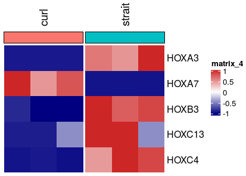
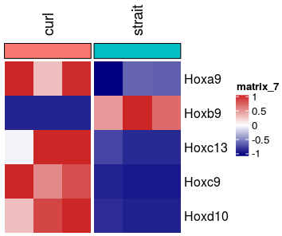
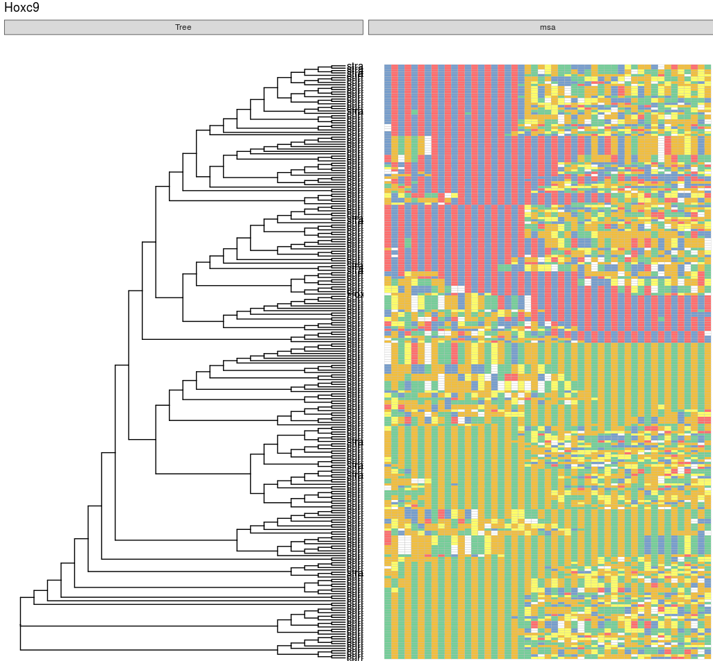

# Figure5 making and Code of analysing

## Quantifying the counts of Homogenous HOX genes in samples

```R
counts_res_1 <- read.csv(file = "/mnt/data/user_data/xiangyu/workshop/roly_poly/bwa_files/hg19/All_data_normalised_and_res.csv")
counts_res_1 <- na.omit(counts_res_1)
counts_res_1 <- subset(counts_res_1,padj < 0.05)
counts_res_1 <- subset(counts_res_1,abs(log2FoldChange) > 1 & baseMean>1)
rownames(counts_res_1) <- counts_res_1$symbol
counts_res_2 <- counts_res_1[,c("curl1", "curl2", "curl3","strait1","strait2","strait3")]
counts_res_2 <- counts_res_2[grep("*HOX",rownames(counts_res_2),value=TRUE),][1:5,]
sampletable <- data.frame(bam_files=c("curl1.sort.bam","curl2.sort.bam",
  "curl3.sort.bam","strait1.sort.bam",
  "strait2.sort.bam","strait3.sort.bam"),
  sample_name=c("curl1","curl2","curl3","strait1","strait2","strait3"),
  group=c("curl","curl","curl","strait","strait","strait")
  )
rownames(sampletable) <- sampletable$sample_name
Roly_Poly_seurat <- CreateSeuratObject(counts_res_2, project='Roly_Poly',meta.data=sampletable)
Idents(Roly_Poly_seurat) <- Roly_Poly_seurat$group
library(RColorBrewer)
aa <- XY_heatmap(seurat_obj=Roly_Poly_seurat,group="group",genes=rownames(counts_res_2),all_num=FALSE,new_names=NULL,labels_rot=90,
  assay_sel="RNA",color=colorRampPalette(c("navy", "white", "firebrick3"))(50)[50:1],min_and_max_cut=1,show_row_names=TRUE,mark_gene=NULL,label_size=0)
```



```R
counts_res_1 <- read.csv(file = "/mnt/data/user_data/xiangyu/workshop/roly_poly/bwa_files/mm10/All_data_normalised_and_res.csv")
counts_res_1 <- na.omit(counts_res_1)
counts_res_1 <- subset(counts_res_1,padj < 0.05)
counts_res_1 <- subset(counts_res_1,abs(log2FoldChange) > 1 & baseMean>5)
rownames(counts_res_1) <- counts_res_1$symbol
counts_res_2 <- counts_res_1[,c("curl1", "curl2", "curl3","strait1","strait2","strait3")]
counts_res_2 <- counts_res_2[grep("*Hox",rownames(counts_res_2),value=TRUE),][1:5,]
sampletable <- data.frame(bam_files=c("curl1.sort.bam","curl2.sort.bam",
  "curl3.sort.bam","strait1.sort.bam",
  "strait2.sort.bam","strait3.sort.bam"),
  sample_name=c("curl1","curl2","curl3","strait1","strait2","strait3"),
  group=c("curl","curl","curl","strait","strait","strait")
  )
rownames(sampletable) <- sampletable$sample_name
Roly_Poly_seurat <- CreateSeuratObject(counts_res_2, project='Roly_Poly',meta.data=sampletable)
Idents(Roly_Poly_seurat) <- Roly_Poly_seurat$group
library(RColorBrewer)
aa <- XY_heatmap(seurat_obj=Roly_Poly_seurat,group="group",genes=rownames(counts_res_2),all_num=FALSE,new_names=NULL,labels_rot=90,
  assay_sel="RNA",color=colorRampPalette(c("navy", "white", "firebrick3"))(50)[50:1],min_and_max_cut=1,show_row_names=TRUE,mark_gene=NULL,label_size=0)
```



## Displaying the Homology of Hoxc9 based on base sequences and amino acid sequences

```R
library(ggplot2)
library(ggmsa)
f <- "/mnt/data/user_data/xiangyu/workshop/roly_poly/similarity/final_out/hox/sub_fa/all_merge_hoxc9.fa"
ggmsa(f, font = NULL, color = "Chemistry_NT", seq_name = TRUE)
library(phangorn)
library(ggtree)
tipseq <- read.phyDat(f, format = "fasta")
bears <- read.phyDat(f,format="fasta",type="DNA")
dm <- dist.ml(bears)
treeUPGMA <- upgma(dm)
rootedtree <- root(treeUPGMA, outgroup='hoxc9_ref')
library(ggtree)
p <- ggtree(rootedtree, branch.length='none') + geom_tiplab()
aa <- msaplot(p, f, offset=1.5) + labs(title="Hoxc9")
ggsave("/mnt/data/user_data/xiangyu/workshop/roly_poly/figure_making/hoxc9_tree.svg", plot=aa,width = 10, height = 5,dpi=1080)
```


```R
library(ggplot2)
library(ggmsa)
library(Biostrings)
f <- "/mnt/data/user_data/xiangyu/workshop/roly_poly/AA_SIM/sub_fa/all_merge_Hoxc9_AA.fa"
library(Biostrings)
x <- readAAStringSet(f)
d <- as.dist(stringDist(x, method = "hamming")/width(x)[1])
library(ape)
tree <- bionj(d)
library(ggtree)
p <- ggtree(tree, branch.length='none') + geom_tiplab()
data <- tidy_msa(x)
p <- p + geom_facet(geom = geom_msa, data = data,  panel = 'msa',
               font = NULL, color = "Chemistry_AA") +
    xlim_tree(1) + labs(title="Hoxc9")
```



