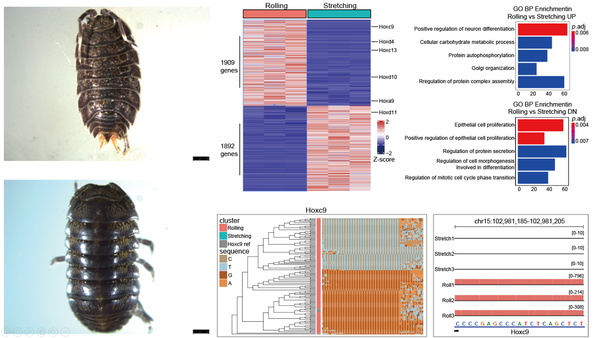

# Hox-regulating-rolling-behavior-in-oniscidea

Transcriptome evidence provides insight into Hox gene regulating rolling behavior in oniscidea



# Citation

Our paper has been published on XXXXX

You could downloaded raw data from [GEO Database XXXXX](https://www.ncbi.nlm.nih.gov/geo/query/acc.cgi?acc=GSE145190)

## Overview of submitted data

The majority of our data in this paper was RNA-seq data. And we submitted all the Rmarkdown files and important processed files to documents respectively. 

## 1. ```code_of_prat1_analysing```

This Rmarkdown file recoded processed steps in de novo whole transcripts reconstruction and homogeneity of variance quantification. And it could be found by [clicking here]()

## 2. ```code_of_part2_analysing``` 

This Rmarkdown file recoded ```figures making```processed steps with ***Code and Graph***. And it could be found by [clicking here](). All the processed files could be downloaded in ```processed_files``` 

## 3. ```processed_files``` 

All the processed files mentioned in ```code_of_part2_analysing.md```  had been stored in this document. 