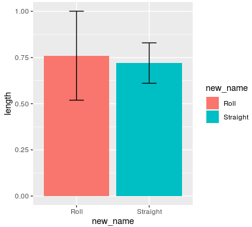
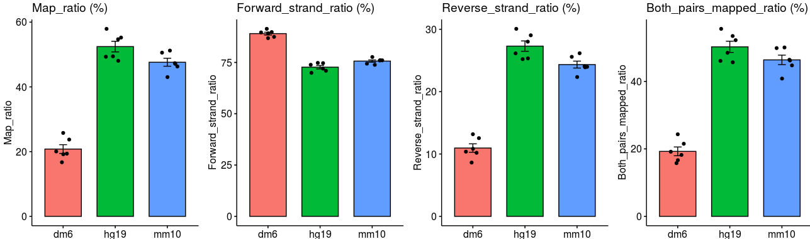
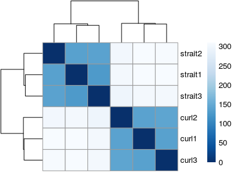
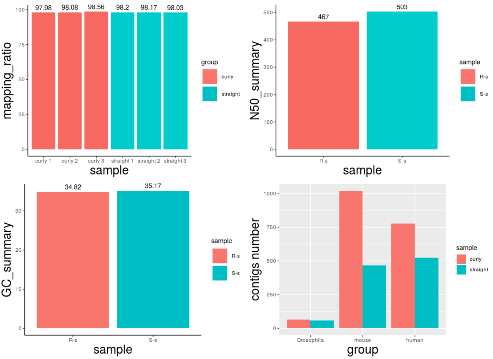
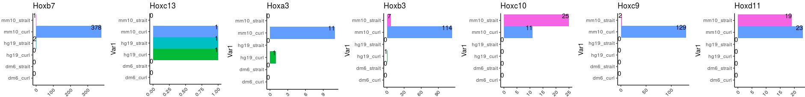
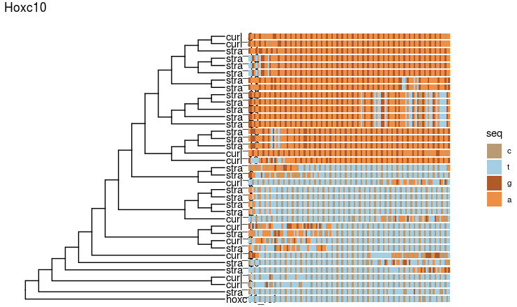
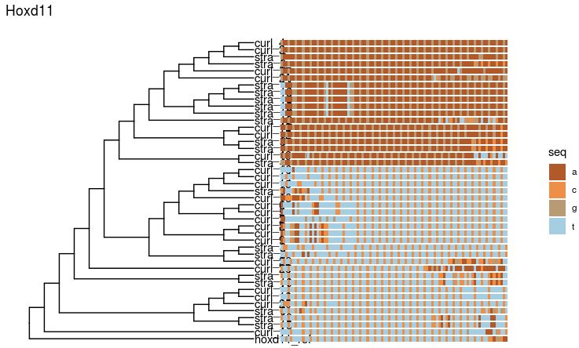
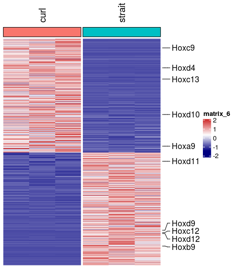
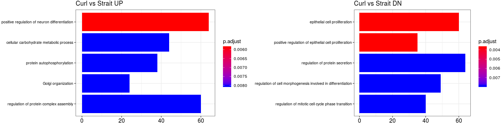
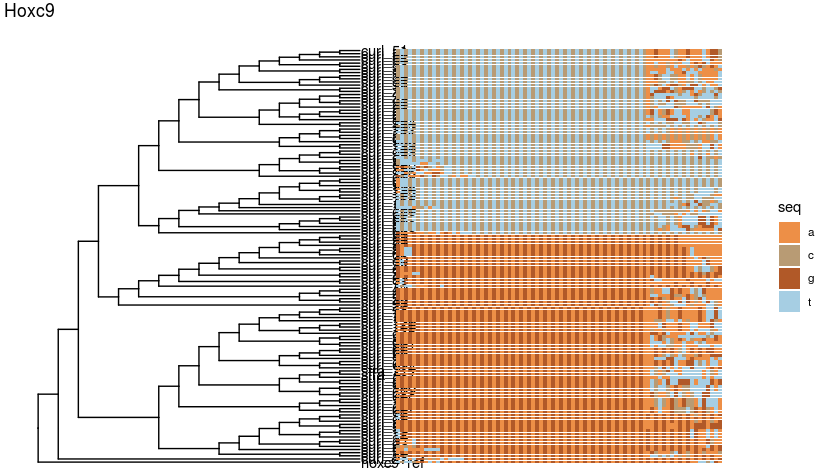

# Code of analysing

## 1. Loading required packages

```R
suppressPackageStartupMessages({
  library(dplyr)
  library(Seurat)
  library(Matrix)
  library(proxy)
  library(gplots)
  library(Rtsne)
  library(densityClust)
  library(irlba)
  library(monocle)
  library(plyr)
  library(DOSE)
  library(clusterProfiler)
  library(topGO)
  library(AnnotationDbi)
  library(cowplot)
  library(ggplot2)
  library(trqwe)
  library(Rsamtools)
  library(GenomicFeatures)
  library(GenomicAlignments)
  library(BiocParallel)
  library(pheatmap)
  library(RColorBrewer)
  library(PoiClaClu)
  library(org.Mm.eg.db)
  library(org.Hs.eg.db)
  library(DESeq2)
  library(stringr)
  library(tidyr)
})
source("/mnt/data/user_data/xiangyu/programme/R_PACKAGES/my_code/MyBestFunction_scRNA.R")
library(future)
library(future.apply)
options(future.globals.maxSize = 300 * 1024^3)
plan("multiprocess", workers = 15)
plan()
library(scales)
library(BuenColors)			
```

## Figure1 making

~~~R
AA <- data.frame(type=c("Roll1", "Roll2", "Roll3", "Roll4", "Roll5", "Straight1", "Straight2", "Straight3", "Straight4", "Straight5"),
  length=c(0.9, 1.1, 0.7, 0.6, 0.5, 0.8, 0.8, 0.8, 0.6, 0.6),
  new_name=c("Roll", "Roll", "Roll", "Roll", "Roll", "Straight", "Straight", "Straight", "Straight", "Straight"))
data_summary <- function(data, varname, groupnames){
  require(plyr)
  summary_func <- function(x, col){
    c(mean = mean(x[[col]], na.rm=TRUE),
      sd = sd(x[[col]], na.rm=TRUE))
  }
  data_sum<-ddply(data, groupnames, .fun=summary_func,
                  varname)
 data_sum <- rename(data_sum, c("mean" = varname))
 return(data_sum)
}

df3 <- data_summary(AA, varname="length", 
                    groupnames=c("new_name"))
df3$new_name=as.factor(df3$new_name)
p <- ggplot(df3,aes(x=new_name, y=length, fill=new_name))
p <- p + geom_bar(stat="identity", position=position_dodge())
p <- p + geom_errorbar(aes(ymin=length-sd, ymax=length+sd), width=.2,
                 position=position_dodge(.9))
p
~~~



## Figure2 making

```R
Summary <- read.csv("/mnt/data/user_data/xiangyu/workshop/roly_poly/alignment.csv")
Summary$Map_ratio <- 100*(Summary$Mapped_reads/Summary$Total_reads)
Summary$Forward_strand_ratio <- 100*(Summary$Forward_strand/Summary$Total_reads)
Summary$Both_pairs_mapped_ratio <- 100*(Summary$Both_pairs_mapped/Summary$Total_reads)
Summary$Reverse_strand_ratio <- 100*(Summary$Reverse_strand/Summary$Total_reads)
library(ggpubr)
p1 <- ggbarplot(Summary, x = "data_type", y = "Map_ratio", legend = "none", fill="data_type",
       add = c("mean_se", "jitter"),title="Map_ratio (%)")
p2 <- ggbarplot(Summary, x = "data_type", y = "Forward_strand_ratio", legend = "none", fill="data_type",
       add = c("mean_se", "jitter"),title="Forward_strand_ratio (%)")
p3 <- ggbarplot(Summary, x = "data_type", y = "Reverse_strand_ratio", legend = "none", fill="data_type",
       add = c("mean_se", "jitter"),title="Reverse_strand_ratio (%)")
p4 <- ggbarplot(Summary, x = "data_type", y = "Both_pairs_mapped_ratio", legend = "none", fill="data_type",
       add = c("mean_se", "jitter"),title="Both_pairs_mapped_ratio (%)")
aa <- plot_grid(p1,p2,p3,p4,nrow=1)
ggsave("/mnt/data/user_data/xiangyu/workshop/roly_poly/figure_making/map_ratio_sum.svg", plot=aa,width = 14, height = 5,dpi=1080)
```



```R
sampletable <- data.frame(bam_files=c("curl1.sort.bam","curl2.sort.bam",
  "curl3.sort.bam","strait1.sort.bam",
  "strait2.sort.bam","strait3.sort.bam"),
  sample_name=c("curl1","curl2","curl3","strait1","strait2","strait3"),
  group=c("curl","curl","curl","strait","strait","strait")
)
rownames(sampletable) <- sampletable$bamfiles

load(file="/mnt/data/user_data/xiangyu/workshop/roly_poly/bwa_files/hg19/se.RData")
colData(se) <- DataFrame(sampletable)
dds <- DESeqDataSet(se, design = ~ group)
countdata <- assay(se)
coldata <- colData(se)

rld <- rlog(dds, blind = FALSE)
sampleDists <- dist(t(assay(rld)))
samplePoisDistMatrix <- as.matrix(sampleDists)
rownames(samplePoisDistMatrix) <- paste(rld$sample_name)
colnames(samplePoisDistMatrix) <- NULL
colors <- colorRampPalette( rev(brewer.pal(9, "Blues")) )(255)
pdf(file="/mnt/data/user_data/xiangyu/workshop/roly_poly/figure_making/hg19_cluster_pheatmap_samples.pdf",width = 5, height = 5)
pheatmap(samplePoisDistMatrix,
clustering_distance_rows = sampleDists,
clustering_distance_cols = sampleDists,
col = colors)
dev.off()
```


```R
require("ggplot2")
pcaData <- plotPCA(rld, intgroup = c("sample_name","bam_files"), returnData = TRUE)
percentVar <- round(100 * attr(pcaData, "percentVar"))
pcaData$group <- sampletable$group
pcaData$group <- factor(pcaData$group,levels=c("strait","curl"))
aa <- ggplot(pcaData,aes(x=PC1,y=PC2,color = group))+ geom_point(size =2) + 
labs(title="PCA Cluster")+
xlab(paste0("PC1: ", percentVar[1], "% variance")) +
ylab(paste0("PC2: ", percentVar[2], "% variance"))+
coord_fixed()
ggsave("/mnt/data/user_data/xiangyu/workshop/roly_poly/figure_making/hg19_pca.svg", plot=aa,width = 7, height = 5,dpi=1080)
```


```R
sampletable <- data.frame(bam_files=c("curl1.sort.bam","curl2.sort.bam",
  "curl3.sort.bam","strait1.sort.bam",
  "strait2.sort.bam","strait3.sort.bam"),
  sample_name=c("curl1","curl2","curl3","strait1","strait2","strait3"),
  group=c("curl","curl","curl","strait","strait","strait")
)
rownames(sampletable) <- sampletable$bamfiles
load(file="/mnt/data/user_data/xiangyu/workshop/roly_poly/bwa_files/mm10/se.RData")
colData(se) <- DataFrame(sampletable)
dds <- DESeqDataSet(se, design = ~ group)
countdata <- assay(se)
coldata <- colData(se)

rld <- rlog(dds, blind = FALSE)
sampleDists <- dist(t(assay(rld)))
samplePoisDistMatrix <- as.matrix(sampleDists)
rownames(samplePoisDistMatrix) <- paste(rld$sample_name)
colnames(samplePoisDistMatrix) <- NULL
colors <- colorRampPalette( rev(brewer.pal(9, "Blues")) )(255)
pdf(file="/mnt/data/user_data/xiangyu/workshop/roly_poly/figure_making/mm10_cluster_pheatmap_samples.pdf",width = 5, height = 5)
pheatmap(samplePoisDistMatrix,
clustering_distance_rows = sampleDists,
clustering_distance_cols = sampleDists,
col = colors)
dev.off()
```



```R
require("ggplot2")
pcaData <- plotPCA(rld, intgroup = c("sample_name","bam_files"), returnData = TRUE)
percentVar <- round(100 * attr(pcaData, "percentVar"))
pcaData$group <- sampletable$group
pcaData$group <- factor(pcaData$group,levels=c("strait","curl"))
aa <- ggplot(pcaData,aes(x=PC1,y=PC2,color = group))+ geom_point(size =2) + 
annotate('text', label = 'strait', x = -25, y = -1.25, size = 5, colour = '#619cff') +
annotate('text', label = 'curl', x = 25, y = 0.5, size = 5, colour = '#f8766d') + labs(title="PCA Cluster")+
xlab(paste0("PC1: ", percentVar[1], "% variance")) +
ylab(paste0("PC2: ", percentVar[2], "% variance"))+
coord_fixed()
ggsave("/mnt/data/user_data/xiangyu/workshop/roly_poly/figure_making/mm10_pca.svg", plot=aa,width = 7, height = 5,dpi=1080)

```


## Figure3 making

~~~
sample <- c("straight 1","straight 2","straight 3","curly 1","curly 2","curly 3")
mapping_ratio <- c(98.20,98.17,98.03,97.98,98.08,98.56)
group <- c("straight","straight","straight","curly","curly","curly")
mydata <- data.frame(sample,mapping_ratio,group)

p0 <- ggplot(mydata,aes(x=sample,y=mapping_ratio,fill=group)) + geom_bar(position="dodge",stat="identity",size = 10)+
geom_bar(stat = "identity", fill = c("#f76961","#f76961","#f76961","#00CCCC","#00CCCC","#00CCCC")) +
geom_text(label=mydata$mapping_ratio ,colour = "black", vjust=-0.5) +
theme(axis.title.x =element_text(size=20), axis.title.y=element_text(size=20)) +
theme(panel.grid.major =element_blank(), panel.grid.minor = element_blank(),panel.background = element_blank(),axis.line = element_line(colour = "black"))
ggsave("/mnt/data/userdata/zhaolei/project/denovo_roly/Trinity_mapping.svg",plot=p0,width = 9,height = 7,dpi=1080)

sample <- c("S-s","R-s")
GC_summary <- c(35.17,34.82)
mydata <- data.frame(sample,GC_summary)

p1 <- ggplot(mydata,aes(x=sample,y=GC_summary,fill=sample)) + geom_bar(position="dodge",stat="identity",size = 10)+
geom_bar(stat = "identity", fill = c("#f76961","#00CCCC")) +
geom_text(label=mydata$GC_summary ,colour = "black", vjust=-0.5) +
theme(axis.title.x =element_text(size=20), axis.title.y=element_text(size=20)) +
theme(panel.grid.major =element_blank(), panel.grid.minor = element_blank(),panel.background = element_blank(),axis.line = element_line(colour = "black"))

sample <- c("S-s","R-s")
N50_summary <- c(503,467)
mydata <- data.frame(sample,N50_summary)

p2 <- ggplot(mydata,aes(x=sample,y=N50_summary,fill=sample)) + geom_bar(position="dodge",stat="identity",size = 10)+
geom_bar(stat = "identity", fill = c("#f76961","#00CCCC")) +
geom_text(label=mydata$N50_summary ,colour = "black", vjust=-0.5) +
theme(axis.title.x =element_text(size=20), axis.title.y=element_text(size=20)) +
theme(panel.grid.major =element_blank(), panel.grid.minor = element_blank(),panel.background = element_blank(),axis.line = element_line(colour = "black"))


sample <- c("straight","curly")
align_gene_number <- c(59,65)
group <- c("Drosophlia","Drosophlia")
dmdata <- data.frame(sample,align_gene_number,group)

sample <- c("straight","curly")
align_gene_number <- c(466,1021)
group <- c("mouse","mouse")
micedata <- data.frame(sample,align_gene_number,group)

sample <- c("straight","curly")
align_gene_number <- c(523,779)
group <- c("human","human")
hgdata <- data.frame(sample,align_gene_number,group)

all_align <- rbind(dmdata,micedata,hgdata)

p3 <-ggplot(all_align,aes(x=group,y=align_gene_number,fill=sample))+geom_bar(position="dodge",stat="identity")
p+xlab("group") + ylab("contigs number") + labs(fill="sample")+
theme(axis.title.x =element_text(size=20), axis.title.y=element_text(size=20))
ggsave("/mnt/data/userdata/zhaolei/project/denovo_roly/mummer_align_genes_dif_species.svg",plot=p,width = 10,height = 7,dpi=1080)

multiplot(p0,p1,p2,p3 ,cols=2)
~~~



## Figure4 making

```R
hg19_hox_similarity_strait <- readRDS("/mnt/data/user_data/xiangyu/workshop/roly_poly/similarity/final_out/hg19_hox_similarity_strait_anno.coord.rds")
hg19_hox_similarity_curl <- readRDS("/mnt/data/user_data/xiangyu/workshop/roly_poly/similarity/final_out/hg19_hox_similarity_curl_anno.coord.rds")
mm10_hox_similarity_strait <- readRDS("/mnt/data/user_data/xiangyu/workshop/roly_poly/similarity/final_out/mm10_hox_similarity_strait_anno.coord.rds")
mm10_hox_similarity_curl <- readRDS("/mnt/data/user_data/xiangyu/workshop/roly_poly/similarity/final_out/mm10_hox_similarity_curl_anno.coord.rds")
hg19_hox_similarity_strait$type <- "hg19_strait"
hg19_hox_similarity_curl$type <- "hg19_curl"
mm10_hox_similarity_strait$type <- "mm10_strait"
mm10_hox_similarity_curl$type <- "mm10_curl"
all_info_data <- do.call(rbind,list(hg19_hox_similarity_strait,hg19_hox_similarity_curl,mm10_hox_similarity_strait,mm10_hox_similarity_curl))
summ_hox <- as.data.frame(table(all_info_data$type,all_info_data$ref_gene))
summ_hox <- rbind(summ_hox,data.frame(Var1=c("dm6_curl","dm6_strait"),Var2=c("Nothing","Nothing"),Freq=c(0,0)))
summ_hox$Var1 <- as.character(summ_hox$Var1)

summ_hox <- future_lapply(1:length(unique(summ_hox$Var1)),function(x){
  sel <- unique(summ_hox$Var1)[x]
  tmp <- subset(summ_hox,Var1==sel)
  tmp$Freq <- sum(tmp$Freq)
  return(tmp[1,])
  })
summ_hox <- do.call(rbind,summ_hox)
p1 <- ggplot(summ_hox, aes(x=Var1, y=Freq, fill=Var1))+
geom_bar(width = 1, stat = "identity") +
geom_text(label=summ_hox$Freq ,colour = "black", vjust=-0.5)+
theme_classic()+ rotate_x_text(angle = 45)

mm10_hox_similarity_curl$ref_gene <- as.character(mm10_hox_similarity_curl$ref_gene)
mm10_hox_similarity_strait$ref_gene <- as.character(mm10_hox_similarity_strait$ref_gene)
hg19_hox_similarity_curl$ref_gene <- as.character(hg19_hox_similarity_curl$ref_gene)
hg19_hox_similarity_strait$ref_gene <- as.character(hg19_hox_similarity_strait$ref_gene)
similar_geness <- data.frame(num_Genes=c(length(unique(hg19_hox_similarity_strait$ref_gene)),
  length(unique(hg19_hox_similarity_curl$ref_gene)),
  length(unique(mm10_hox_similarity_strait$ref_gene)),
  length(unique(mm10_hox_similarity_curl$ref_gene)),0,0),
  type=c("hg19_strait","hg19_curl","mm10_strait","mm10_curl","dm6_strait","dm6_curl")
  )
p2 <- ggplot(similar_geness, aes(x=type, y=num_Genes, fill=type))+
  geom_bar(width = 1, stat = "identity") +
  geom_text(label=similar_geness$num_Genes ,colour = "black", vjust=-0.5)+
  theme_classic()+ rotate_x_text(angle = 45)
aa <- plot_grid(p1,p2,nrow=1)
ggsave("/mnt/data/user_data/xiangyu/workshop/roly_poly/figure_making/HOX_Genes_summ.svg", plot=aa,width = 6, height = 4,dpi=1080)
```


```R
summ_hox <- as.data.frame(table(all_info_data$type,all_info_data$ref_gene))
summ_hox$Var1 <- as.character(summ_hox$Var1)
summ_hox$Var2 <- as.character(summ_hox$Var2)
summ_hox$Var2 <- gsub("HOXB","Hoxb",summ_hox$Var2)
summ_hox$Var2 <- gsub("HOXC","Hoxc",summ_hox$Var2)
summ_hox$Var2 <- gsub("HOXA","Hoxa",summ_hox$Var2)
summ_hox <- rbind(summ_hox,data.frame(Var1=c(rep("dm6_curl",length(unique(summ_hox$Var2))),rep("dm6_strait",length(unique(summ_hox$Var2)))),Var2=unique(summ_hox$Var2),Freq=c(rep(0,length(unique(summ_hox$Var2))))))
summ_hox <- future_lapply(1:length(unique(summ_hox$Var2)),function(x){
  sel <- unique(summ_hox$Var2)[x]
  tmp <- subset(summ_hox,Var2==sel)
  tmp_hox <- future_lapply(1:length(unique(tmp$Var1)),function(i){
    sel <- unique(tmp$Var1)[i]
    tmp <- subset(tmp,Var1==sel)
    tmp$Freq <- sum(tmp$Freq)
    return(tmp[1,])
    })
  tmp_hox <- do.call(rbind,tmp_hox)
  return(tmp_hox)
  })
summ_hox <- do.call(rbind,summ_hox)
p1 <- ggplot(subset(summ_hox,Var2=="Hoxb7"), aes(x=Var1, y=Freq, fill=Var1))+
  geom_bar(width = 1, stat = "identity") +
  geom_text(label=subset(summ_hox,Var2=="Hoxb7")$Freq ,colour = "black", vjust=-0.5,hjust=1)+
  theme_classic()+ rotate_x_text(angle = 45) + labs(title="Hoxb7")+
  coord_flip() + theme(legend.position = "none")
p2 <- ggplot(subset(summ_hox,Var2=="Hoxc13"), aes(x=Var1, y=Freq, fill=Var1))+
  geom_bar(width = 1, stat = "identity") +
  geom_text(label=subset(summ_hox,Var2=="Hoxc13")$Freq ,colour = "black", vjust=-0.5,hjust=1)+
  theme_classic()+ rotate_x_text(angle = 45) + labs(title="Hoxc13")+
  coord_flip() + theme(legend.position = "none")
p3 <- ggplot(subset(summ_hox,Var2=="Hoxa3"), aes(x=Var1, y=Freq, fill=Var1))+
  geom_bar(width = 1, stat = "identity") +
  geom_text(label=subset(summ_hox,Var2=="Hoxa3")$Freq ,colour = "black", vjust=-0.5,hjust=1)+
  theme_classic()+ rotate_x_text(angle = 45) + labs(title="Hoxa3")+
  coord_flip() + theme(legend.position = "none")
p4 <- ggplot(subset(summ_hox,Var2=="Hoxb3"), aes(x=Var1, y=Freq, fill=Var1))+
  geom_bar(width = 1, stat = "identity") +
  geom_text(label=subset(summ_hox,Var2=="Hoxb3")$Freq ,colour = "black", vjust=-0.5,hjust=1)+
  theme_classic()+ rotate_x_text(angle = 45) + labs(title="Hoxb3")+
  coord_flip() + theme(legend.position = "none")
p5 <- ggplot(subset(summ_hox,Var2=="Hoxc10"), aes(x=Var1, y=Freq, fill=Var1))+
  geom_bar(width = 1, stat = "identity") +
  geom_text(label=subset(summ_hox,Var2=="Hoxc10")$Freq ,colour = "black", vjust=-0.5,hjust=1)+
  theme_classic()+ rotate_x_text(angle = 45) + labs(title="Hoxc10")+
  coord_flip() + theme(legend.position = "none")
p6 <- ggplot(subset(summ_hox,Var2=="Hoxc9"), aes(x=Var1, y=Freq, fill=Var1))+
  geom_bar(width = 1, stat = "identity") +
  geom_text(label=subset(summ_hox,Var2=="Hoxc9")$Freq ,colour = "black", vjust=-0.5,hjust=1)+
  theme_classic()+ rotate_x_text(angle = 45) + labs(title="Hoxc9")+
  coord_flip() + theme(legend.position = "none")
p7 <- ggplot(subset(summ_hox,Var2=="Hoxd11"), aes(x=Var1, y=Freq, fill=Var1))+
  geom_bar(width = 1, stat = "identity") +
  geom_text(label=subset(summ_hox,Var2=="Hoxd11")$Freq ,colour = "black", vjust=-0.5,hjust=1)+
  theme_classic()+ rotate_x_text(angle = 45) + labs(title="Hoxd11")+
  coord_flip() + theme(legend.position = "none")
aa <- plot_grid(p1,p2,p3,p4,p5,p6,p7,nrow=1)
ggsave("/mnt/data/user_data/xiangyu/workshop/roly_poly/figure_making/HOX_Genes_individ.svg", plot=aa,width = 17, height = 3,dpi=1080)
```



```R
library(ggplot2)
library(ggmsa)
f <- "/mnt/data/user_data/xiangyu/workshop/roly_poly/similarity/final_out/hox/sub_fa/all_merge_hoxc10.fa"
ggmsa(f, font = NULL, color = "Chemistry_NT", seq_name = TRUE)
library(phangorn)
library(ggtree)
tipseq <- read.phyDat(f, format = "fasta")
bears <- read.phyDat(f,format="fasta",type="DNA")
dm <- dist.ml(bears)
treeUPGMA <- upgma(dm)
rootedtree <- root(treeUPGMA, outgroup='hoxc10_ref')
library(ggtree)
p <- ggtree(rootedtree, branch.length='none') + geom_tiplab()
aa <- msaplot(p, f, offset=1.5) + labs(title="Hoxc10")
ggsave("/mnt/data/user_data/xiangyu/workshop/roly_poly/figure_making/hoxc10_tree.svg", plot=aa,width = 10, height = 5,dpi=1080)

```




```R
library(ggplot2)
library(ggmsa)
f <- "/mnt/data/user_data/xiangyu/workshop/roly_poly/similarity/final_out/hox/sub_fa/all_merge_hoxd11.fa"
ggmsa(f, font = NULL, color = "Chemistry_NT", seq_name = TRUE)
library(phangorn)
library(ggtree)
tipseq <- read.phyDat(f, format = "fasta")
bears <- read.phyDat(f,format="fasta",type="DNA")
dm <- dist.ml(bears)
treeUPGMA <- upgma(dm)
rootedtree <- root(treeUPGMA, outgroup='hoxd11_ref')
library(ggtree)
p <- ggtree(rootedtree, branch.length='none') + geom_tiplab()
aa <- msaplot(p, f, offset=1.5) + labs(title="Hoxd11")
ggsave("/mnt/data/user_data/xiangyu/workshop/roly_poly/figure_making/Hoxd11_tree.svg", plot=aa,width = 10, height = 5,dpi=1080)
```



## Figure5 making

```R

counts_res_1 <- read.csv(file = "/mnt/data/user_data/xiangyu/workshop/roly_poly/bwa_files/mm10/All_data_normalised_and_res.csv")
counts_res_1 <- na.omit(counts_res_1)
counts_res_1 <- subset(counts_res_1,padj < 0.05)
counts_res_1 <- subset(counts_res_1,abs(log2FoldChange) > 0.5)
counts_res_1 <- counts_res_1[order(counts_res_1$log2FoldChange,decreasing=TRUE),]
counts <- counts_res_1[,c(1:7)]
rownames(counts) <- counts$X
counts <- counts[,-1]
sampletable <- data.frame(bam_files=c("curl1.sort.bam","curl2.sort.bam",
  "curl3.sort.bam","strait1.sort.bam",
  "strait2.sort.bam","strait3.sort.bam"),
  sample_name=c("curl1","curl2","curl3","strait1","strait2","strait3"),
  group=c("curl","curl","curl","strait","strait","strait")
  )
rownames(sampletable) <- sampletable$sample_name
Roly_Poly_seurat <- CreateSeuratObject(counts, project='Roly_Poly',meta.data=sampletable)
Idents(Roly_Poly_seurat) <- Roly_Poly_seurat$group
mark_gene <- grep("Hox",rownames(counts),value=TRUE)
library(RColorBrewer)
pdf(file="/mnt/data/user_data/xiangyu/workshop/roly_poly/figure_making/mm10_DGE.pdf",width = 5, height = 5)
aa <- XY_heatmap(seurat_obj=Roly_Poly_seurat,group="group",genes=rownames(counts),all_num=FALSE,new_names=NULL,labels_rot=90,
  assay_sel="RNA",color=colorRampPalette(c("navy", "white", "firebrick3"))(50)[50:1],min_and_max_cut=2,show_row_names=FALSE,mark_gene=mark_gene,label_size=0)
dev.off()
```



```R
GOdownres_1_all <- readRDS("/mnt/data/user_data/xiangyu/workshop/roly_poly/bwa_files/mm10/Curl_DN_GO_BP.rds")
GOupres_1_all <- readRDS("/mnt/data/user_data/xiangyu/workshop/roly_poly/bwa_files/mm10/Curl_UP_GO_BP.rds")
ff <- barplot(GOupres_1_all,showCategory=5)
ff1 <- ff + theme(axis.text.y = element_text(size = 8)) +labs(title = NULL)
p1 <- ff1 + labs(title="Curl vs Strait UP")

ff <- barplot(GOdownres_1_all,showCategory=5)
ff1 <- ff + theme(axis.text.y = element_text(size = 8)) +labs(title = NULL)
p2 <- ff1+ labs(title="Curl vs Strait DN")
aa <- cowplot::plot_grid(p1,p2)
aa
```



```R
library(ggplot2)
library(ggmsa)
f <- "/mnt/data/user_data/xiangyu/workshop/roly_poly/similarity/final_out/hox/sub_fa/all_merge_hoxc9.fa"
ggmsa(f, font = NULL, color = "Chemistry_NT", seq_name = TRUE)
library(phangorn)
library(ggtree)
tipseq <- read.phyDat(f, format = "fasta")
bears <- read.phyDat(f,format="fasta",type="DNA")
dm <- dist.ml(bears)
treeUPGMA <- upgma(dm)
rootedtree <- root(treeUPGMA, outgroup='hoxc9_ref')
library(ggtree)
p <- ggtree(rootedtree, branch.length='none') + geom_tiplab()
aa <- msaplot(p, f, offset=1.5) + labs(title="Hoxc9")
ggsave("/mnt/data/user_data/xiangyu/workshop/roly_poly/figure_making/hoxc9_tree.svg", plot=aa,width = 10, height = 5,dpi=1080)

```



## sessionInfo

```R
sessionInfo()
```

```R
R version 3.6.3 (2020-02-29)
Platform: x86_64-pc-linux-gnu (64-bit)
Running under: Ubuntu 16.04.6 LTS

Matrix products: default
BLAS:   /usr/lib/libblas/libblas.so.3.6.0
LAPACK: /usr/lib/lapack/liblapack.so.3.6.0

locale:
 [1] LC_CTYPE=en_US.UTF-8       LC_NUMERIC=C
 [3] LC_TIME=zh_CN.UTF-8        LC_COLLATE=en_US.UTF-8
 [5] LC_MONETARY=zh_CN.UTF-8    LC_MESSAGES=en_US.UTF-8
 [7] LC_PAPER=zh_CN.UTF-8       LC_NAME=C
 [9] LC_ADDRESS=C               LC_TELEPHONE=C
[11] LC_MEASUREMENT=zh_CN.UTF-8 LC_IDENTIFICATION=C

attached base packages:
 [1] grid      splines   stats4    parallel  stats     graphics  grDevices
 [8] utils     datasets  methods   base

other attached packages:
 [1] ggtree_2.0.2                phangorn_2.6.0
 [3] ape_5.3                     ggmsa_0.0.4
 [5] ComplexHeatmap_2.2.0        gdtools_0.2.2
 [7] ggpubr_0.2.5                magrittr_1.5
 [9] BuenColors_0.5.5            MASS_7.3-51.5
[11] scales_1.1.0                future.apply_1.5.0
[13] future_1.17.0               tidyr_1.0.2
[15] nichenetr_0.1.0             iTALK_0.1.0
[17] stringr_1.4.0               data.table_1.12.8
[19] DESeq2_1.26.0               org.Mm.eg.db_3.10.0
[21] PoiClaClu_1.0.2.1           RColorBrewer_1.1-2
[23] pheatmap_1.0.12             GenomicAlignments_1.22.1
[25] SummarizedExperiment_1.16.1 DelayedArray_0.12.2
[27] BiocParallel_1.20.1         matrixStats_0.56.0
[29] GenomicFeatures_1.38.2      Rsamtools_2.2.3
[31] Biostrings_2.54.0           XVector_0.26.0
[33] GenomicRanges_1.38.0        GenomeInfoDb_1.22.1
[35] trqwe_0.1                   velocyto.R_0.6
[37] cowplot_1.0.0               pathview_1.26.0
[39] org.Hs.eg.db_3.10.0         topGO_2.38.1
[41] SparseM_1.78                GO.db_3.10.0
[43] AnnotationDbi_1.48.0        IRanges_2.20.2
[45] S4Vectors_0.24.3            graph_1.64.0
[47] clusterProfiler_3.14.3      DOSE_3.12.0
[49] plyr_1.8.6                  monocle_2.14.0
[51] DDRTree_0.1.5               VGAM_1.1-2
[53] ggplot2_3.2.1               Biobase_2.46.0
[55] BiocGenerics_0.32.0         irlba_2.3.3
[57] densityClust_0.3            Rtsne_0.15
[59] gplots_3.0.3                proxy_0.4-23
[61] Matrix_1.2-18               Seurat_3.1.5
[63] dplyr_0.8.5

loaded via a namespace (and not attached):
  [1] minpack.lm_1.2-1
  [2] graphlayouts_0.6.0
  [3] pbapply_1.4-2
  [4] lattice_0.20-40
  [5] haven_2.2.0
  [6] vctrs_0.2.4
  [7] V8_3.0.2
  [8] fastICA_1.2-2
  [9] mgcv_1.8-31
 [10] blob_1.2.1
 [11] survival_3.1-11
 [12] prodlim_2019.11.13
 [13] DBI_1.1.0
 [14] SingleCellExperiment_1.8.0
 [15] rappdirs_0.3.1
 [16] uwot_0.1.8
 [17] jpeg_0.1-8.1
 [18] zlibbioc_1.32.0
 [19] MatrixModels_0.4-1
 [20] pcaMethods_1.78.0
 [21] ChIPseeker_1.25.0
 [22] htmlwidgets_1.5.1
 [23] mvtnorm_1.1-0
 [24] GlobalOptions_0.1.1
 [25] miscTools_0.6-26
 [26] laeken_0.5.1
 [27] leiden_0.3.3
 [28] DEoptimR_1.0-8
 [29] tidygraph_1.1.2
 [30] Rcpp_1.0.4.6
 [31] readr_1.3.1
 [32] KernSmooth_2.23-16
 [33] gdata_2.18.0
 [34] limma_3.42.2
 [35] seqmagick_0.1.3
 [36] Hmisc_4.4-0
 [37] ShortRead_1.44.3
 [38] RSpectra_0.16-0
 [39] fastmatch_1.1-0
 [40] ranger_0.12.1
 [41] digest_0.6.25
 [42] png_0.1-7
 [43] qlcMatrix_0.9.7
 [44] sctransform_0.2.1
 [45] ggraph_2.0.2
 [46] pkgconfig_2.0.3
 [47] docopt_0.6.1
 [48] gower_0.2.1
 [49] iterators_1.0.12
 [50] URD_1.1.0
 [51] reticulate_1.15
 [52] network_1.16.0
 [53] circlize_0.4.8
 [54] GetoptLong_0.1.8
 [55] modeltools_0.2-23
 [56] xfun_0.13
 [57] zoo_1.8-7
 [58] tidyselect_1.0.0
 [59] reshape2_1.4.4
 [60] purrr_0.3.4
 [61] ica_1.0-2
 [62] viridisLite_0.3.0
 [63] rtracklayer_1.46.0
 [64] rlang_0.4.5
 [65] hexbin_1.28.1
 [66] glue_1.4.0
 [67] ensembldb_2.10.2
 [68] ggseqlogo_0.1
 [69] lava_1.6.7
 [70] europepmc_0.3
 [71] ggsignif_0.6.0
 [72] recipes_0.1.10
 [73] labeling_0.3
 [74] chipseq_1.36.0
 [75] DEsingle_1.6.0
 [76] gggenes_0.4.0
 [77] class_7.3-15
 [78] preprocessCore_1.48.0
 [79] RMTstat_0.3
 [80] Sierra_0.2.0
 [81] DO.db_2.9
 [82] annotate_1.64.0
 [83] jsonlite_1.6.1
 [84] systemfonts_0.2.0
 [85] bit_1.1-15.2
 [86] gridExtra_2.3
 [87] gmodels_2.18.1
 [88] stringi_1.4.6
 [89] quadprog_1.5-8
 [90] bitops_1.0-6
 [91] RSQLite_2.2.0
 [92] randomForest_4.6-14
 [93] KEGGgraph_1.46.0
 [94] rstudioapi_0.11
 [95] nlme_3.1-147
 [96] qvalue_2.18.0
 [97] locfit_1.5-9.4
 [98] VariantAnnotation_1.32.0
 [99] listenv_0.8.0
[100] ggthemes_4.2.0
[101] gridGraphics_0.5-0
[102] dbplyr_1.4.3
[103] TTR_0.23-6
[104] readxl_1.3.1
[105] lifecycle_0.2.0
[106] ggfittext_0.8.1
[107] timeDate_3043.102
[108] munsell_0.5.0
[109] cellranger_1.1.0
[110] hwriter_1.3.2
[111] visNetwork_2.0.9
[112] caTools_1.18.0
[113] codetools_0.2-16
[114] lmtest_0.9-37
[115] htmlTable_1.13.3
[116] triebeard_0.3.0
[117] lsei_1.2-0
[118] xtable_1.8-4
[119] ROCR_1.0-7
[120] diptest_0.75-7
[121] BiocManager_1.30.10
[122] Signac_0.2.5
[123] scatterplot3d_0.3-41
[124] abind_1.4-5
[125] farver_2.0.3
[126] FNN_1.1.3
[127] RANN_2.6.1
[128] askpass_1.1
[129] biovizBase_1.34.1
[130] sparsesvd_0.2
[131] RcppAnnoy_0.0.16
[132] patchwork_1.0.0.9000
[133] tibble_3.0.1
[134] dichromat_2.0-0
[135] cluster_2.1.0
[136] tidytree_0.3.3
[137] ellipsis_0.3.0
[138] prettyunits_1.1.1
[139] lubridate_1.7.8
[140] ggridges_0.5.2
[141] igraph_1.2.5
[142] RcppEigen_0.3.3.7.0
[143] fgsea_1.12.0
[144] slam_0.1-47
[145] destiny_3.0.1
[146] VIM_5.1.1
[147] htmltools_0.4.0
[148] BiocFileCache_1.10.2
[149] plotly_4.9.2.1
[150] XML_3.99-0.3
[151] ModelMetrics_1.2.2.2
[152] e1071_1.7-3
[153] foreign_0.8-76
[154] withr_2.2.0
[155] fitdistrplus_1.0-14
[156] randomcoloR_1.1.0.1
[157] bit64_0.9-7
[158] foreach_1.5.0
[159] ProtGenerics_1.18.0
[160] robustbase_0.93-6
[161] scde_2.14.0
[162] combinat_0.0-8
[163] GOSemSim_2.13.1
[164] rsvd_1.0.3
[165] memoise_1.1.0
[166] forcats_0.5.0
[167] rio_0.5.16
[168] geneplotter_1.64.0
[169] gamlss_5.1-6
[170] gamlss.data_5.1-4
[171] caret_6.0-86
[172] curl_4.3
[173] DiagrammeR_1.0.5
[174] fdrtool_1.2.15
[175] TxDb.Hsapiens.UCSC.hg19.knownGene_3.2.2
[176] urltools_1.7.3
[177] xts_0.12-0
[178] acepack_1.4.1
[179] edgeR_3.28.1
[180] checkmate_2.0.0
[181] Gviz_1.30.3
[182] npsurv_0.4-0
[183] maxLik_1.3-8
[184] rjson_0.2.20
[185] openxlsx_4.1.4
[186] ggrepel_0.8.2
[187] distillery_1.0-7
[188] clue_0.3-57
[189] Lmoments_1.3-1
[190] tools_3.6.3
[191] sandwich_2.5-1
[192] soGGi_1.18.0
[193] RCurl_1.98-1.2
[194] car_3.0-7
[195] ggplotify_0.0.5
[196] xml2_1.3.2
[197] httr_1.4.1
[198] assertthat_0.2.1
[199] AnnotationFilter_1.10.0
[200] boot_1.3-24
[201] globals_0.12.5
[202] R6_2.4.1
[203] nnet_7.3-13
[204] RcppHNSW_0.2.0
[205] treeio_1.10.0
[206] progress_1.2.2
[207] genefilter_1.68.0
[208] KEGGREST_1.26.1
[209] gtools_3.8.2
[210] shape_1.4.4
[211] Rook_1.1-1
[212] carData_3.0-3
[213] colorspace_1.4-1
[214] generics_0.0.2
[215] base64enc_0.1-3
[216] smoother_1.1
[217] pillar_1.4.3
[218] Rgraphviz_2.30.0
[219] tweenr_1.0.1
[220] sp_1.4-1
[221] ggplot.multistats_1.0.0
[222] HSMMSingleCell_1.6.0
[223] rvcheck_0.1.8
[224] GenomeInfoDbData_1.2.2
[225] extRemes_2.0-11
[226] gtable_0.3.0
[227] bdsmatrix_1.3-4
[228] zip_2.0.4
[229] knitr_1.28
[230] RcppArmadillo_0.9.860.2.0
[231] latticeExtra_0.6-29
[232] gamlss.dist_5.1-6
[233] biomaRt_2.42.1
[234] Cairo_1.5-12
[235] pscl_1.5.5
[236] flexmix_2.3-15
[237] quantreg_5.55
[238] vcd_1.4-7
[239] BSgenome_1.54.0
[240] openssl_1.4.1
[241] backports_1.1.6
[242] plotrix_3.7-8
[243] ipred_0.9-9
[244] enrichplot_1.6.1
[245] brew_1.0-6
[246] hms_0.5.3
[247] ggforce_0.3.1
[248] polyclip_1.10-0
[249] numDeriv_2016.8-1.1
[250] bbmle_1.0.23.1
[251] lazyeval_0.2.2
[252] Formula_1.2-3
[253] tsne_0.1-3
[254] crayon_1.3.4
[255] MAST_1.12.0
[256] pROC_1.16.2
[257] svglite_1.2.3
[258] viridis_0.5.1
[259] rpart_4.1-15
[260] compiler_3.6.3
```

